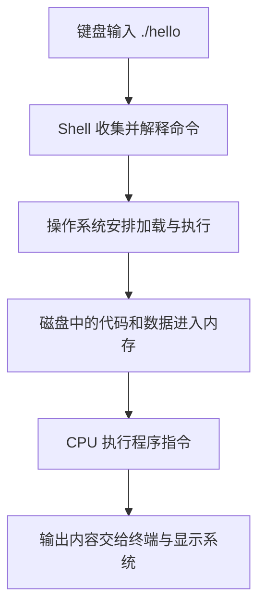

# 1-2：运行一个程序，CPU 和存储设备怎样配合

> 原视频：[九曲阑干 · 1-2.计算机系统漫游](https://www.bilibili.com/video/BV115411h72j/) · 8 分 35 秒\
> [返回课程目录](../../README.md) · [图文文稿](../../transcripts/02_1-2_计算机系统漫游.md)

## 核心结论

- 可执行文件存放在磁盘上，执行时需要把相关代码与数据加载进内存。
- CPU 按指令工作：程序计数器保存指令地址，寄存器暂存数据，运算部件完成计算。
- 一个简单的打印程序也涉及多次数据搬运；缓存与存储层次就是为降低这些搬运的代价而设计的。

## 1. Shell 负责接收并解释命令

上一讲得到了可执行文件 `hello`。在 Linux 的 Shell 中输入：

```sh
./hello
```

`./` 表示当前目录，`hello` 是程序名。Shell 是命令解释程序：显示提示符、读取输入、解释命令，再请求执行相应操作。前台程序结束后，通常又能看到提示符。


[回看画面 00:57](https://www.bilibili.com/video/BV115411h72j/?t=57)

Shell 自己也是程序。后面的进程章节会解释，它如何借助操作系统创建进程、加载程序并等待程序完成。本讲先把注意力放在硬件如何配合。

[回看 Shell：00:30](https://www.bilibili.com/video/BV115411h72j/?t=30)

## 2. CPU 里的三个部件，各管一件事

| 部件 | 可以怎样理解 | 它负责什么 |
|---|---|---|
| PC，程序计数器 | 指令位置记录 | 保存与指令执行位置有关的地址 |
| 寄存器文件 | CPU 内部的一组小存储格 | 临时保存操作数、地址和结果 |
| ALU，算术逻辑单元 | 计算部件 | 完成加减、位运算等操作 |

例如计算 `a + b`，概念上可以先从内存取出两个值放进寄存器，再由 ALU 运算，把结果写回寄存器。写入新值会覆盖寄存器中的旧值。


[回看画面 02:27](https://www.bilibili.com/video/BV115411h72j/?t=147)

PC 的关键是“地址”，不是“已经执行了多少条指令”。遇到跳转指令时，下一条执行的指令不一定紧挨着当前指令。


[回看画面 03:12](https://www.bilibili.com/video/BV115411h72j/?t=192)

**字长与字节：**课堂用 32 位机器和 64 位机器说明“字”的大小。常见 64 位环境中的指针占 8 字节，因为 `64 bit ÷ 8 = 8 byte`；这不表示内存容量就是 8 GB。“字”的具体定义还取决于体系结构语境。

## 3. 内存、总线和设备把整台机器连接起来


[回看画面 04:57](https://www.bilibili.com/video/BV115411h72j/?t=297)

主存也叫内存，存放执行所需的指令和数据。逻辑上可以把按字节寻址的内存看成一个大数组，每个字节都有对应地址。

总线和互连负责在部件之间传递信息。键盘、显示器、磁盘等输入输出设备通过相应控制器或适配器参与系统。图中画的是便于理解的组织方式，实际电脑可能采用更复杂的互连结构。

[回看硬件组成：04:30](https://www.bilibili.com/video/BV115411h72j/?t=270)

## 4. 从按下回车到显示文字，信息经历了几次移动




[回看画面 05:42](https://www.bilibili.com/video/BV115411h72j/?t=342)

视频还介绍了 **DMA，直接内存访问**：设备可以在相应硬件支持下把数据传到内存，避免让 CPU 逐字节搬运。CPU 仍需要参与配置、管理和完成处理，不能把 DMA 理解成“整个过程完全不需要 CPU”。


[回看画面 06:27](https://www.bilibili.com/video/BV115411h72j/?t=387)

本讲用箭头示意代码、数据和输出的移动路径。实际的 `printf` 还会涉及库、缓冲、系统调用和终端等细节；这些箭头用于建立整体认识。

[回看程序加载：05:30](https://www.bilibili.com/video/BV115411h72j/?t=330)

## 5. 缓存用小而快的空间，减少访问大而慢的空间

CPU 从寄存器读取数据很快，但寄存器容量很小；内存容量大一些，访问更慢；磁盘则能保存更多内容，访问延迟通常更高。我们无法用同样的成本，让所有存储都同时“很大又很快”。


[回看画面 07:26](https://www.bilibili.com/video/BV115411h72j/?t=446)

因此，系统在 CPU 和内存之间安排 L1、L2、L3 等高速缓存，保存一部分可能很快再次使用的数据。


[回看画面 08:11](https://www.bilibili.com/video/BV115411h72j/?t=491)

| 往存储层次上方看 | 往存储层次下方看 |
|---|---|
| 通常容量更小 | 通常容量更大 |
| 通常访问更快 | 通常访问更慢 |
| 每字节成本更高 | 每字节成本更低 |

视频中的容量和访问速度倍率用于展示数量级，不能当成所有电脑都满足的固定参数。第六章会进一步解释，程序为什么可以通过良好的访问顺序提高缓存命中率。

## 容易混淆的地方

- CPU、内存和磁盘各有分工；程序文件保存在磁盘，不代表 CPU 就直接从磁盘逐条执行它。
- PC 保存执行位置相关的地址；寄存器也可以保存普通数据，二者用途不同。
- “缓存更快”有前提：请求的数据已经在缓存中。未命中时仍可能需要访问下一层。

## 自测

**问题：**既然 CPU 很快，为什么单纯提高 CPU 的计算速度，有时不能明显加速程序？

<details><summary>查看答案</summary>

程序可能把大量时间花在等待数据上，例如等待内存或磁盘。计算部件更快并不会自动缩短数据传输时间；减少访问、改善访问顺序或提高命中率才可能解决这一瓶颈。

</details>

## 来源

- [原视频与课堂动画](https://www.bilibili.com/video/BV115411h72j/)：九曲阑干。
- 按画面字幕与课堂图示整理；字节换算、DMA 边界和实际输出路径说明为教学补充。
