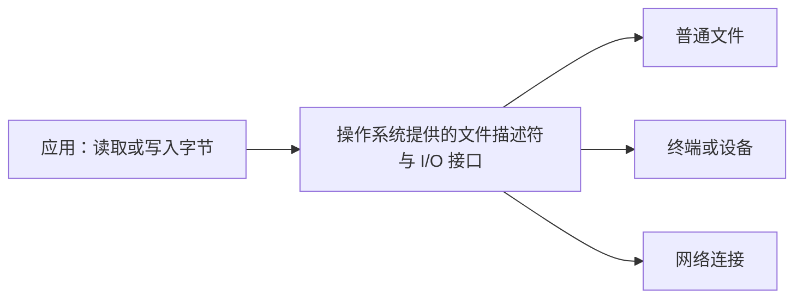

# 1-3：操作系统用进程、虚拟内存和文件组织资源

> 原视频：[九曲阑干 · 1-3.计算机系统漫游](https://www.bilibili.com/video/BV1mi4y137g8/) · 5 分 28 秒\
> [返回课程目录](../../README.md) · [图文文稿](../../transcripts/03_1-3_计算机系统漫游.md)

## 核心结论

- 操作系统管理硬件资源，并向应用提供统一的使用方式。
- 进程描述一个运行中的程序及其执行环境；上下文切换让 CPU 能在不同进程之间切换。
- 虚拟内存给进程提供独立的地址空间；文件则为多种输入输出提供相似的操作接口。

## 1. 抽象让程序不用事事面对硬件细节

“抽象”可以理解为：把复杂实现藏在后面，向使用者提供明确的概念和接口。例如，读取文件时，程序主要关心读哪个文件、读多少字节，无需自行控制磁盘电机。

[回看画面 02:27](https://www.bilibili.com/video/BV1mi4y137g8/?t=147)

操作系统这样做有两个重要目的：保护资源，防止程序失控；提供统一机制，减少程序对具体硬件实现的依赖。应用仍会直接执行普通指令、访问获准访问的内存；需要内核完成的受保护操作，则通常通过系统调用请求。

| 操作系统概念 | 帮助程序怎样理解系统 |
|---|---|
| 进程 | 我正在运行，并有自己的执行状态和资源 |
| 虚拟内存 | 我通过自己的一套地址来访问内存 |
| 文件 | 我可以通过读写接口交换字节数据 |

[回看操作系统分工：00:30](https://www.bilibili.com/video/BV1mi4y137g8/?t=30)

## 2. 上下文切换让暂停的进程能够接着运行

视频用 Shell 与 `hello` 两个进程解释这个过程：Shell 等待输入，用户要求运行 `hello`，系统安排新程序执行；`hello` 结束后，Shell 继续工作。

[回看画面 01:42](https://www.bilibili.com/video/BV1mi4y137g8/?t=102)

[回看画面 00:57](https://www.bilibili.com/video/BV1mi4y137g8/?t=57)

**上下文**是恢复执行所需的状态。比如，程序执行到哪条指令、寄存器里保存了哪些值、使用怎样的地址空间。切换时，需要保存当前执行状态并恢复另一个进程的相关状态。

可以类比为同时读两本书：切换前记住当前页，换回时从标记处继续。但操作系统记录的状态比一个书签丰富得多。

视频还引出了线程：同一进程内的线程共享代码、数据等资源，同时各有自己的执行状态。一个进程可以只有一个线程，也可以有多个线程。

[回看上下文切换：01:30](https://www.bilibili.com/video/BV1mi4y137g8/?t=90)

## 3. 虚拟地址空间给不同内容安排了不同区域

虚拟内存让进程通过自己的虚拟地址访问数据。两个进程即使出现相同的地址数值，也不意味着它们必然访问同一块物理内存。

[回看画面 04:42](https://www.bilibili.com/video/BV1mi4y137g8/?t=282)

[回看画面 03:12](https://www.bilibili.com/video/BV1mi4y137g8/?t=192)

视频用简化的 Linux 进程地址空间示意图介绍这些区域：

| 区域 | 常见用途 |
|---|---|
| 代码与只读数据 | 程序指令、只读常量等 |
| 可读写数据 | 全局变量、静态存储期对象等 |
| 堆 | 动态内存分配使用的一部分空间 |
| 内存映射区域 | 共享库、文件映射等 |
| 用户栈 | 函数调用相关的返回地址、局部存储等 |
| 内核相关区域 | 由系统管理，用户程序不能随意访问 |

[回看画面 03:57](https://www.bilibili.com/video/BV1mi4y137g8/?t=237)

在视频展示的常见栈布局中，栈向较低地址增长。函数调用和返回可能改变栈的使用量，但不能把所有函数调用都等同于一次固定的“压栈”：实际行为取决于指令集、调用约定和编译优化。

**读图时保留三个边界：**它是结构示意图；现代系统可能用地址随机化改变布局；`malloc` 的分配也可能使用内存映射等机制，并非所有请求都来自一段连续增长的传统堆。

[回看地址空间：03:30](https://www.bilibili.com/video/BV1mi4y137g8/?t=210)

## 4. “一切皆文件”强调接口统一

磁盘上的普通文件、终端、某些设备和网络连接，底层实现差别很大，但程序经常可以用相似的读写接口与它们交互。

统一接口不表示它们的所有性质相同。例如，有些对象能随机定位读取位置，有些只能按数据到达顺序读取。这个抽象减少了程序必须了解的底层差异。

## 自测

**问题：**两个不同进程都显示变量地址为 `0x1000`，是否足以证明它们共享这个变量？

查看答案

不能。这里通常看到的是各自地址空间中的虚拟地址。是否共享数据，取决于相应的内存映射与共享机制，不能只比较地址字符串。

## 来源

- [原视频与课堂动画](https://www.bilibili.com/video/BV1mi4y137g8/)：九曲阑干。
- 按画面字幕与课堂图示整理；地址随机化、分配器及调用约定的边界说明为教学补充。
