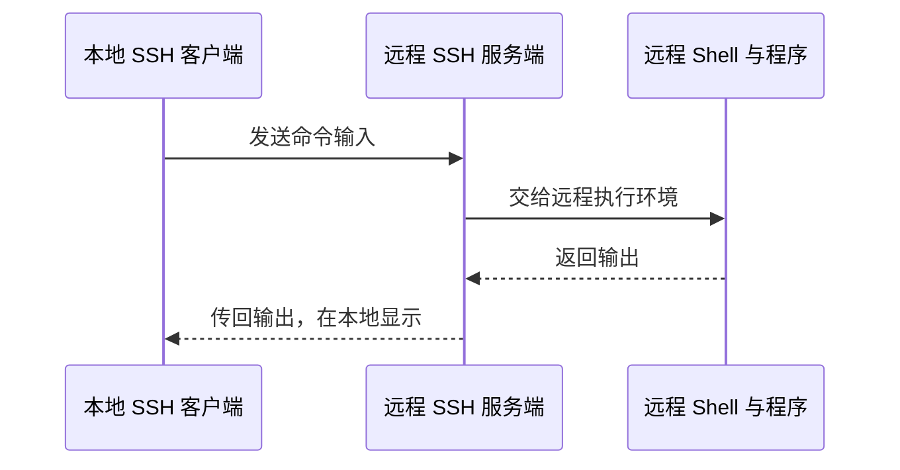

# 1-4：网络连接计算机，并行加速仍受瓶颈约束

> 原视频：[九曲阑干 · 1-4.计算机系统漫游](https://www.bilibili.com/video/BV1MC4y1t77F/) · 6 分 12 秒\
> [返回课程目录](../../README.md) · [图文文稿](../../transcripts/04_1-4_计算机系统漫游.md)

## 核心结论

- 通过网络，可以在另一台计算机上执行程序，再把结果传回本地。
- Amdahl 定律说明：局部加速对整体有多大帮助，取决于它原来占用了多少时间。
- 多核、同时多线程、指令级并行和 SIMD 从不同层次提高资源利用率，它们各有适用条件。

## 1. 远程运行程序，靠客户端和服务端传递请求

视频把前面本地运行 `hello` 的过程扩展到两台机器：本地客户端接收输入，通过网络发给远程服务端；远程 Shell 运行程序，再将输出传回本地显示。


[回看画面 01:11](https://www.bilibili.com/video/BV1MC4y1t77F/?t=71)



教材原有示例使用 Telnet，视频换用更常见的 SSH 来解释。重点是区分：输入和显示发生在本地，而被请求的程序可以运行在远端。

[回看远程执行：01:30](https://www.bilibili.com/video/BV1MC4y1t77F/?t=90)

## 2. Amdahl 定律先问“被优化的部分占多大”

假设一个程序原来总共运行 $T_{old}$ 秒，其中比例为 $\alpha$ 的部分可以优化。把这部分加速到原来的 $k$ 倍，表示它现在只需要原来 $1/k$ 的时间。


[回看画面 02:25](https://www.bilibili.com/video/BV1MC4y1t77F/?t=145)

新总时间是：

$$
T_{new}=(1-\alpha)T_{old}+\frac{\alpha T_{old}}{k}
$$

整体加速比是“原来时间除以现在时间”：

$$
S=\frac{T_{old}}{T_{new}}=\frac{1}{(1-\alpha)+\alpha/k}
$$

沿用视频的例子，$\alpha=0.6$，$k=3$。如果程序原来耗时 100 秒，40 秒保持不变，另外 60 秒缩短为 20 秒：

```text
原来：40 + 60 = 100 秒
现在：40 + 20 =  60 秒
整体加速比：100 / 60 ≈ 1.67
```

即使那 60 秒被优化到几乎不花时间，剩下的 40 秒仍然存在，整体上限也只是 `100 / 40 = 2.5` 倍。


[回看画面 03:03](https://www.bilibili.com/video/BV1MC4y1t77F/?t=183)

这个结论基于固定工作量以及未优化部分基本不变等假设。实际并行还有调度、通信和同步开销，未必达到理想值。

[回看 Amdahl 定律：02:30](https://www.bilibili.com/video/BV1MC4y1t77F/?t=150)

## 3. 多核和同时多线程，都在提高执行资源利用率

**多核**是在一颗处理器芯片中放入多个计算核心。合适的工作可以分给不同核心执行。视频用每核具有私有缓存、多个核心共享更低层缓存的结构做示意；具体缓存组织随处理器而异。


[回看画面 03:50](https://www.bilibili.com/video/BV1MC4y1t77F/?t=230)

**同时多线程（SMT）**让一个核心维护多套线程执行状态，同时共享部分执行资源。超线程是其中一种实现的商品名称。


[回看画面 04:32](https://www.bilibili.com/video/BV1MC4y1t77F/?t=272)

当一个线程等待数据时，另一个线程有机会利用部分空闲资源。但共享执行单元也意味着可能竞争，所以“4 核 8 线程”不能直接当成“8 个完整物理核心”。

视频提到的切换周期等数字用于说明机制，不宜当作所有硬件的固定性能参数。

## 4. 指令级并行和 SIMD，在更细的层次上并行

| 方式 | 并行的对象 | 理解例子 |
|---|---|---|
| 线程级并行 | 不同线程中的工作 | 多个核心处理不同任务 |
| 指令级并行，ILP | 同一指令流中的多条指令 | 不互相依赖的操作重叠执行 |
| 单指令多数据，SIMD | 一条指令中的多个数据元素 | 同时处理一组像素或数组元素 |


[回看画面 05:10](https://www.bilibili.com/video/BV1MC4y1t77F/?t=310)

补充例子：给数组中的 4 个数都加上 1，标量方式可以逐个处理；支持相应向量操作的硬件则可能在一次 SIMD 操作中处理多个元素。能够同时处理多少个，取决于数据类型、向量宽度和具体指令。

[回看 SIMD：05:30](https://www.bilibili.com/video/BV1MC4y1t77F/?t=330)

## 5. 虚拟机把抽象扩展到整个系统

本章前面介绍了文件、虚拟内存和进程。本讲最后补充虚拟机：它可以提供一个抽象的计算机运行环境，让操作系统和程序在这个环境中工作。


[回看画面 05:55](https://www.bilibili.com/video/BV1MC4y1t77F/?t=355)

这里先记住它抽象的层次。虚拟机、进程、线程解决的问题不同，不能因为都能“运行程序”就混为一谈。

## 自测

**问题：**一个程序只有 20% 的时间能被优化，就算把这部分时间完全消除，整体最多加速多少？

<details><summary>查看答案</summary>

最多为 $1/(1-0.2)=1.25$ 倍。若原来运行 100 秒，剩余不可加速部分仍需 80 秒。

</details>

## 来源

- [原视频与课堂动画](https://www.bilibili.com/video/BV1MC4y1t77F/)：九曲阑干。
- Amdahl 参数与结论来自课堂；100 秒展开、SIMD 数组例子和条件说明为教学补充。
