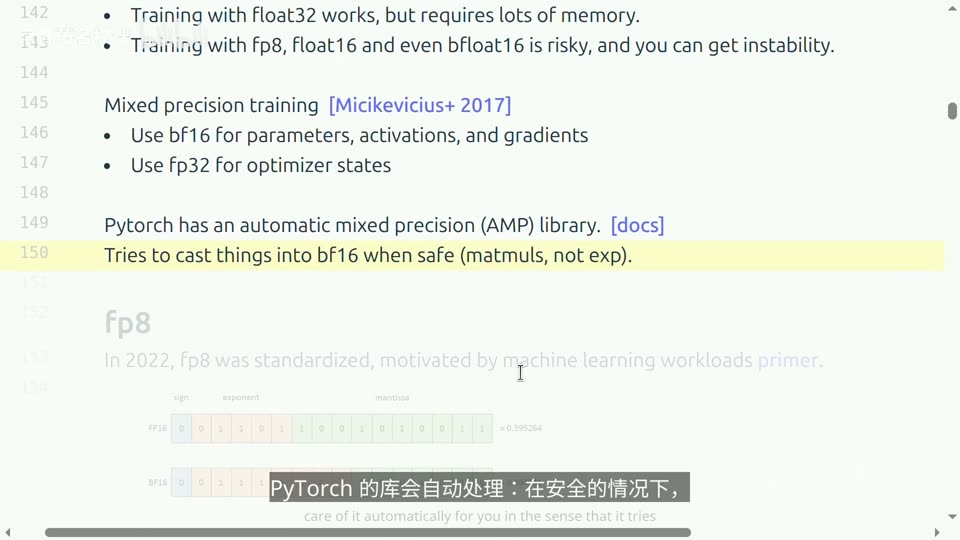
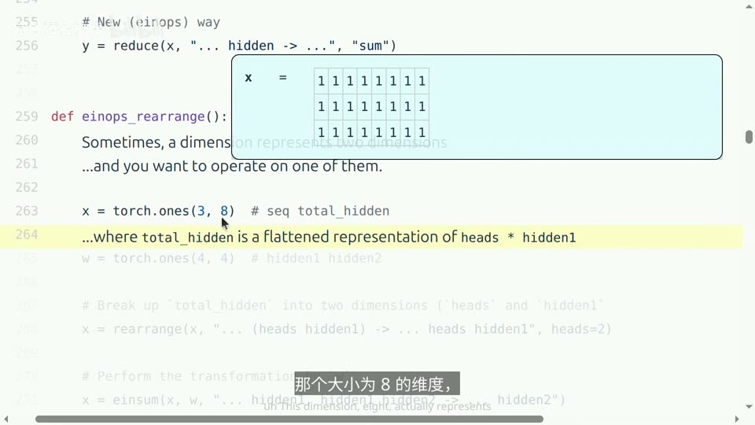
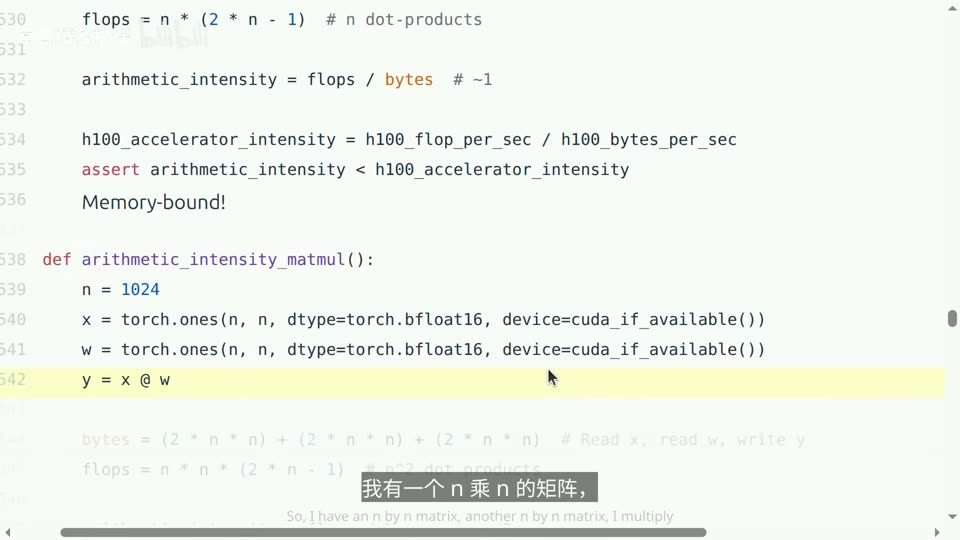

# CS336 Lecture 2：读懂张量，算清训练需要多少资源

假设你准备训练一个语言模型，手里有几张 GPU。开始写训练代码前，你大概会想知道：模型能放进显存吗？一次训练要跑几天？如果程序很慢，是计算太多，还是 GPU 在等数据？

这一讲就是教你回答这些问题。PyTorch 用来写出计算，einops 帮你看清数据的形状；在此基础上，我们再估算内存、计算量和时间。

可以按这条线读下去：**先看数字怎么存，再看模型怎么算，最后看机器需要花多少资源。** 例子中的数字刻意取得很小，方便手算；估算大模型时，方法相同。

## 1. 张量：把一组数字按形状排好

### 1.1 为什么模型代码里到处都是 tensor

在 PyTorch 里，张量（tensor）可以先理解为**多维数组**。一排数是一维，一张数表是二维，多张数表放在一起就是三维。

比如，一个模型一次处理 2 段文本，每段有 3 个 token，每个 token 用 4 个数字表示。这些数字可以放在形状为 `(2, 3, 4)` 的张量里：

```python
import torch

x = torch.zeros(2, 3, 4)
print(x.shape)     # torch.Size([2, 3, 4])
print(x[0, 1])     # 第 1 段文本里第 2 个 token 的 4 个数字
```

这里的 token 是模型处理文本的基本单位，可能是一个字、一个词，或词的一部分。上面的全零张量只是用来演示形状，真实模型会通过嵌入层把 token 转成向量。

三个维度分别表示：

| 维度 | 这个例子里有多大 | 含义 |
|---|---:|---|
| `batch` | 2 | 一次一起处理几段文本 |
| `seq` | 3 | 每段文本有几个 token |
| `feature` | 4 | 每个 token 用几个数字表示 |

因此，看到 `(2, 3, 4)` 时，只知道大小还不够，还要知道每个维度代表什么。后面拆分注意力头、计算矩阵乘法，都要靠这个判断。

模型的权重、输入数据、中间结果也都用张量保存。它们用途不同，但都能用同一套方法检查形状和内存占用。


### 1.2 一个张量占多少内存

**先数有多少个数，再看每个数占多少字节。**

```text
张量数据占用的内存 = 元素个数 × 每个元素的字节数
```

例如，`4 × 8` 的表格里有 32 个数。如果每个数用 4 字节保存，这张表就占 `32 × 4 = 128` 字节。

```python
x = torch.zeros(4, 8, dtype=torch.float32)
print(x.numel())                         # 32 个元素
print(x.element_size())                  # 每个元素 4 字节
print(x.numel() * x.element_size())       # 128 字节
```

这算的是张量里的数据，不包括 Python 对象、显存分配器等额外开销。

同样的算法用到大模型上，数字就很可观：GPT-3 的一个前馈层权重矩阵有 `(12288 × 4) × 12288` 个数。用 FP32 保存，仅这个矩阵就需要约 **2.42 GB，也就是 2.25 GiB**。GB 按十进制换算，GiB 按二进制换算；比较显存数字时要看清单位。

### 1.3 读代码时，先检查这三项

```python
print(x.shape)     # 有几个维度，每个维度多长？
print(x.dtype)     # 每个数按什么类型保存？
print(x.device)    # 放在 CPU 还是某张 GPU 上？
```

通常不修改默认设置时，`torch.zeros(...)` 创建的是 CPU 上的 FP32 张量。有 NVIDIA GPU 时，可以通过 `x.to("cuda")` 把它搬到 GPU；模型参数和参与运算的张量通常也要在同一设备上。

搬数据同样要花时间。机器装了 GPU，不会让仍在 CPU 上执行的张量运算自动加速。

## 2. FP32、FP16、BF16：为什么一个数不一定占 4 字节

### 2.1 少用一些位，就能少占内存

一个字节等于 8 位。因此，32 位浮点数占 4 字节，16 位浮点数占 2 字节。如果把同一批数字从 FP32 换成 BF16，**这批数字本身的存储空间就减半了**。

但计算机能表示的数是有限的。位数变少后，既要考虑“还能表示多大、多小的数”，也要考虑“数值能记得多精细”。

用科学计数法 `1.234 × 10⁵` 类比：`10⁵` 决定数量级，`1.234` 决定这一数量级下能保留多少细节。浮点数把位分给符号、指数和尾数，也是类似的安排。


| 类型 | 每个数占用 | 主要特点 |
|---|---:|---|
| FP32 | 4 字节 | 能表示的范围大，数值也比较精细 |
| FP16 | 2 字节 | 省空间，但能表示的范围明显缩小 |
| BF16 | 2 字节 | 范围接近 FP32，代价是数值刻度比 FP16 更粗 |

FP16 遇到特别小的数，可能直接记成 0；特别大的数则可能溢出。下面这个实验能看到区别：

```python
small_fp16 = torch.tensor([1e-8], dtype=torch.float16)
small_bf16 = torch.tensor([1e-8], dtype=torch.bfloat16)
print(small_fp16.item())     # 0.0
print(small_bf16.item())     # 约 1.00117e-8
```

BF16 保住了这个数的数量级，但也产生了舍入误差。所以“能表示很小的数”和“表示得很准确”是两件事。


### 2.2 混合精度：不同计算选不同精度

训练里有大量矩阵乘法，适当降低精度，可以省显存，也可以利用 GPU 上更快的低精度计算单元。但有些值要经过很多次累积，小变化不能轻易丢掉。

于是就有了**混合精度训练**：让适合的计算使用 BF16 等低精度，把需要更精细累积的部分保留为 FP32。例如，课程后面估算显存时，假设参数和梯度用 BF16，优化器记录的历史量用 FP32。

PyTorch 的 `autocast` 会按运算选择精度。不过，开启它并不意味着所有参数和梯度都变成 BF16。实际存储格式取决于训练实现；后面做显存估算时，要按真实格式计算。



课程还介绍了 FP8 和 FP4。位数进一步减少后，常要给一组数配一个缩放系数，让有限的刻度落在合适的范围里；即便如此也会有误差，还需要相应的硬件和训练方法。第一次读本讲，先理解 FP32、FP16、BF16 的取舍就够了。

## 3. einops：把“改形状”写得更容易看懂

张量维度多起来后，`transpose(-2, -1)` 这样的代码会让人停下来数：“倒数第二个维度到底是什么？”

einops 允许你给维度写上名字，把目的表达出来。它主要解决代码可读性问题；换成 einops，并不保证计算就更快。

### 3.1 `einsum`：哪些数相乘，沿哪个方向相加

先看一个可以手算的矩阵乘法：

```python
from einops import einsum, reduce, rearrange

x = torch.tensor([[1., 2., 3.],
                  [4., 5., 6.]])          # 2 行，每行 3 个特征
w = torch.tensor([[1., 0.],
                  [0., 1.],
                  [1., 1.]])              # 把 3 个特征变成 2 个输出

result = einsum(x, w, "row feature, feature out -> row out")
print(result)
# tensor([[ 4.,  5.],
#         [10., 11.]])
```

这行表达式可以直接读成：

```text
x 是 [row, feature]
w 是 [feature, out]
结果保留 [row, out]，沿 feature 相乘后求和
```

例如左上角的 `4`，就是 `1×1 + 2×0 + 3×1`。`feature` 没出现在箭头右侧，所以这个方向上的乘积要加起来。

它与 `x @ w` 是同一个矩阵乘法。这里用小矩阵解释规则；维度多时，写名字的好处更明显。


比如，同一批文本里的两组向量，要逐个计算相似度。注意力里，把发起比较的一组向量叫 query（查询），用于匹配的另一组叫 key（键）。这里先只看它们怎样两两做点积：

```python
q = torch.randn(2, 3, 4)     # batch, query, feature
k = torch.randn(2, 5, 4)     # batch, key, feature

scores = einsum(q, k, "batch query feature, batch key feature -> batch query key")
print(scores.shape)          # torch.Size([2, 3, 5])
```

每个样本中，3 个 query 分别与 5 个 key 做点积，得到一张 `3 × 5` 的分数表。`batch` 留在输出中，各个样本单独计算；`feature` 被求和。

这些名字是你写给这个表达式用的标签。它们没有自动理解“词”或“特征”的能力；名字相同、是否出现在输出中，才决定了如何配对和求和。

### 3.2 `reduce`：把一排数汇成一个数

如果只想对刚才 `x` 的每一行求平均值：

```python
row_means = reduce(x, "row feature -> row", "mean")
print(row_means)     # tensor([2., 5.])
```

第一行 `(1 + 2 + 3) / 3 = 2`，第二行平均值是 5。每行的三个数变成一个数，所以结果只剩 `row` 这个维度。

这种把一组数汇总为一个结果的操作叫归约。把 `"mean"` 改为 `"sum"` 或 `"max"`，就分别是求和或取最大值。

### 3.3 `rearrange`：拆开、合并、交换维度

假设每个 token 的 4 个特征需要分成 2 组，每组 2 个，供两个注意力头分别使用：

```python
features = torch.arange(24).reshape(2, 3, 4)   # batch, seq, total_feature
heads = rearrange(
    features,
    "batch seq (head channel) -> batch head seq channel",
    head=2,
)
print(heads.shape)                            # torch.Size([2, 2, 3, 2])

merged = rearrange(heads, "batch head seq channel -> batch seq (head channel)")
print(torch.equal(features, merged))          # True
```

括号 `(head channel)` 表示两个长度相乘：原来的 4 被拆成 `2 × 2`。`head=2` 指定拆成几组，否则程序无法知道你想拆成 `2×2` 还是 `4×1`。

这个例子把 24 个数重新组织了一遍，没有增加数，也没有做出完整的注意力计算。底层是否复制数据，取决于原张量的布局和变换方式。



## 4. 从张量到训练：模型到底在反复做什么

接下来要估算训练成本，先看清一次训练的过程。

下面是一个很小的模型：把 4 个输入特征变成 8 个中间特征，经过 ReLU，再输出一个预测值。ReLU 把负数变成 0，正数保留。

```python
from torch import nn
import torch.nn.functional as F

model = nn.Sequential(
    nn.Linear(4, 8, bias=False),
    nn.ReLU(),
    nn.Linear(8, 1, bias=False),
)
print(sum(p.numel() for p in model.parameters()))   # 4×8 + 8×1 = 40
```

`nn.Linear` 创建线性层和可学习的权重；`nn.Sequential` 把这些层按顺序接起来。这里共有 40 个参数，也就是训练需要调整的 40 个数。

给它 16 个样本，做一次训练更新：

```python
inputs = torch.randn(16, 4)
targets = torch.randn(16, 1)             # 随机目标，仅用于演示流程
optimizer = torch.optim.AdamW(model.parameters(), lr=0.001)

optimizer.zero_grad(set_to_none=True)   # 清掉之前的梯度
predictions = model(inputs)            # 前向：算出预测，形状为 [16, 1]
loss = F.mse_loss(predictions, targets) # 用均方误差衡量预测与目标的差距
loss.backward()                        # 反向：计算损失对各参数的梯度
optimizer.step()                       # 按梯度更新参数
```

梯度表示：某个参数略微变化，会让损失怎样变化。PyTorch 在前向计算时记录必要的关系，`backward()` 根据这些关系自动求导，结果保存在参数的 `.grad` 中；真正修改参数的是 `optimizer.step()`。

这也解释了训练时为什么不只需要存模型权重：

| 要保存的东西 | 在上面例子中的作用 |
|---|---|
| 参数 | 两个线性层中需要学习的权重 |
| 激活 | 前向算出的中间结果，反向求导时还要用 |
| 梯度 | 损失对参数的导数，供优化器更新参数 |
| 优化器状态 | 优化器记录的历史信息，帮助决定这次怎么更新 |

Adam 类优化器会为每个参数记录两组历史量：梯度的移动平均、梯度平方的移动平均。参数有多少个，这两组数通常也各有多少个，后面算显存时必须一起算进去。

## 5. FLOPs：数清一次训练要做多少计算

### 5.1 计算量与计算速度，单位不同

**FLOPs** 表示一共做了多少次浮点运算，是工作量。例如，一次乘法和一次加法，通常计为 2 FLOPs。

**FLOP/s** 表示每秒能做多少次浮点运算，是速度。两者的关系就像距离和车速：

```text
时间 = 总工作量 ÷ 每秒完成的工作量
```

先数工作量，再估机器实际能跑多快，才能算出时间。

### 5.2 矩阵乘法的计算量，为什么是 `2 × M × d × k`

设输入矩阵 `X` 有 `M` 行，每行 `d` 个特征；权重矩阵 `W` 把这 `d` 个特征变成 `k` 个输出：

```text
X [M, d] × W [d, k] → Y [M, k]
```

输出共有 `M × k` 个数。每个数都要做一次长度为 `d` 的点积，也就是大约 `d` 次乘法加上 `d` 次加法。因此：

```text
矩阵乘法 FLOPs ≈ 输出数目 × 每个输出的计算量
              ≈ (M × k) × (2 × d)
              = 2Mdk
```

严格算，一个点积是 `d` 次乘法、`d−1` 次加法。大矩阵中这点差别很小，所以估算时用 `2d`。

`W` 一共有 `d × k` 个参数。如果把它记成 `P`，上面的公式就变成了：

```text
这层的前向计算量 ≈ 2 × 输入行数 × 参数量 = 2MP
```

对语言模型来说，每个 token 都有一行特征向量。一次输入 `B` 段文本、每段 `S` 个 token，这些线性层就要处理 `M = B × S` 行。


### 5.3 从前向的 `2` 到训练的 `6`

训练还要反向求梯度。对 `Y = XW` 这一层，反向通常需要做两件事：计算权重的梯度，以及把梯度传给前面的层。

如果把从后面传来的梯度记作 `G`，两项计算是：

```text
权重梯度：XᵀG
输入梯度：GWᵀ
```

它们各做一次矩阵乘法，工作量都与前向相近。于是，矩阵乘法主导的网络可以这样估算：

| 阶段 | 主要做什么 | 近似计算量 |
|---|---|---:|
| 前向 | 用参数算出结果 | `2 × token 数 × 参数量` |
| 反向 | 算参数梯度、向前传递梯度 | `4 × token 数 × 参数量` |
| 合计 | 一次前向加一次反向 | `6 × token 数 × 参数量` |

如果整个训练过程处理了 `T` 个 token，模型有 `P` 个参数：

```text
训练总 FLOPs ≈ 6PT
```

这就是常见的 **`6ND`** 公式：很多资料用 `N` 表示参数量、`D` 表示训练 token 数。这里只是换成 `P` 和 `T`，避免与矩阵维度混淆。

例如，每步处理 `B × S` 个 token，训练 `K` 步，总 token 数就是 `T = B × S × K`。同一段数据如果训练多遍，每次处理都要计入 `T`。


`6PT` 是估算，不是所有模型都适用的精确公式。它主要统计参数矩阵的乘法，适合做密集模型的初步预算；长上下文的注意力还有随序列长度平方增长的计算。激活重计算会增加实际工作量，跨 GPU 通信等也会额外耗时。

## 6. GPU 很快，为什么程序还是慢

### 6.1 数据装得下，也可能送不过来

GPU 的计算单元需要先拿到数据，才能开始计算。数据从显存读出来，算完以后，结果还要写回去。

因此，要分开看两个问题：

| 问题 | 取决于什么 | 常见表现 |
|---|---|---|
| 能不能装下数据 | 显存容量，单位 GB | 装不下就报显存不足，也就是 OOM |
| 能不能及时送到计算单元 | 显存带宽，单位 GB/s 或 TB/s | 装得下，但计算单元经常等数据 |

可以想象一个很快的厨师。如果每切一下菜，都要等人从仓库送一次原料，厨师再快也没用。如果一批原料拿过来能连续加工很多次，才容易发挥他的速度。

在 GPU 上，后一种情况对应更高的**算术强度**：

```text
算术强度 = 浮点运算次数 ÷ 从显存读取和写回的数据字节数
```

它回答的是：**每搬一个字节，能用它做多少计算？**

### 6.2 为什么大型矩阵乘法通常更容易发挥 GPU 的性能

以两个 `n × n` 的 BF16 矩阵相乘为例。先按“每个输入读一次、结果写一次”的理想情况估算：

```text
运算量 ≈ 2n³ FLOPs
搬运量 ≈ 两个输入 + 一个输出
       = 3 × n² × 2 字节 = 6n² 字节
算术强度 ≈ 2n³ / 6n² = n/3
```

矩阵变大时，计算量按三次方增长，数据量按平方增长。一个读进来的数能参与更多次乘法，因此搬一次数据能做更多工作。

把几类操作放在一起比较，更容易看出差别。以下均按 BF16 和简化的显存读写量估算：

| 操作 | 主要计算 | 大致算术强度（FLOP/字节） |
|---|---|---:|
| ReLU | 每个数与 0 比较 | `0.25`，把一次比较近似计作一次操作 |
| GELU | 每个数做更复杂的激活计算 | 约 `5`，取决于具体实现 |
| 长度为 `n` 的点积 | 两排数对应相乘再相加 | 约 `0.5` |
| `n × n` 矩阵乘向量 | 每行做一次点积 | 约 `1` |
| 两个 `n × n` 矩阵相乘 | 同一批数据反复参与点积 | 约 `n/3` |



这也解释了一个容易意外的现象：GELU 每个数做的计算比 ReLU 多，但不一定按相同比例更慢。如果两者的耗时都主要花在读写显存上，多做几次计算未必明显增加总时间。把相邻操作合在一个内核里、少做几次显存读写，有时比减少几次乘法更有效。

这里算的是理想的数据复用。真实矩阵乘法能不能接近它，还取决于分块、缓存、矩阵形状和实现方式。

### 6.3 Roofline：速度有两道限制

一段程序的速度，既不能超过 GPU 的计算峰值，也不能超过数据供应的速度。后者乘上“每字节能做多少计算”，就得到带宽允许的计算速度：

```text
可达到的 FLOP/s ≤ min(计算峰值, 显存带宽 × 算术强度)
```

画成图，就是 Roofline（屋顶线）：左边先随算术强度上升，说明计算在等数据；右边到达计算峰值后变平，说明计算能力成为限制。


课程采用的 H100 SXM 数字是：稠密 BF16 峰值约 `989.5 TFLOP/s`，显存带宽约 `3.35 TB/s`。把两者相除：

```text
989.5 / 3.35 ≈ 295 FLOP/字节
```

在这套简化模型里，每搬一个字节能做的计算远少于 295 次，通常更容易受带宽限制；超过这个量级，才有机会接近计算峰值。这个分界依赖 GPU 型号、精度和实际实现，不是所有机器共用的常数。

### 6.4 为什么训练和逐词生成会表现不同

训练时，往往把很多 token 放在一起计算。同一组权重读进来后，可以用于很多行输入，比较容易形成大矩阵乘法。

生成文本时，每段对话通常一次只新增一个 token。若同时处理的对话很少，每步输入很小，却仍要读取大量权重和历史 K/V 缓存，就更容易卡在显存带宽上。

因此，推理的**预填充阶段**（处理整段提示）和**解码阶段**（逐个生成新 token）也可能有不同瓶颈。增大同时处理的请求数，可以提高数据复用，但会占用更多显存，还要满足响应时间要求。

## 7. 从计算量估算训练时间

### 7.1 规格表上的峰值，不能直接当实际速度

GPU 会花时间搬数据、通信和等待，不能持续把所有计算单元用满。估算整个训练过程时，通常要用 **MFU（模型浮点运算利用率）**，把理论峰值折算成模型实际完成工作的速度。

```text
MFU = 模型估算的 FLOPs ÷（实测用时 × GPU 数量 × 单卡对应精度的峰值 FLOP/s）
```

例如 MFU 为 0.5，就表示按这套模型计算量口径，实际每秒完成的工作约为集群理论峰值的一半。它不是任务管理器中显示的“GPU 忙碌百分比”。

MFU 低，需要结合模型大小、矩阵形状、带宽、通信和数据加载来查原因。单个大矩阵乘法的利用率很高，也不代表完整训练就能达到同样水平。


查规格表时尤其要确认**精度和稠密／稀疏条件**。课程引用的 H100 BF16 约 `1979 TFLOP/s` 是带结构化稀疏性的数字，普通稠密矩阵乘法的对应值约为一半。不能拿一个较大的峰值直接套到所有计算上。

### 7.2 完整算例：70B 模型，15T token，1024 张 H100

这里 `70B` 是 700 亿参数，`15T` 是 15 万亿个训练 token。假设用 1024 张上述 H100，端到端 MFU 为 0.5。

先算总工作量，再算集群每秒实际完成多少工作：

```python
parameters = 70e9
tokens = 15e12
gpu_count = 1024
peak_flops_per_second = 989.5e12
mfu = 0.5

total_flops = 6 * parameters * tokens
cluster_flops_per_second = gpu_count * peak_flops_per_second * mfu
seconds = total_flops / cluster_flops_per_second
days = seconds / 86400
print(round(days, 1))     # 143.9 天
```

这个结果说明的是：**按这些假设，量级约为 144 天**。MFU、token 数、GPU 数变了，结果也会跟着变；硬件故障、重跑和其他未计入的开销还会影响实际工期。

这里 `6.3 × 10²⁴` 的单位是 FLOPs，`15 × 10¹²` 的单位才是 token。文章里出现很大的数字时，先看它数的到底是什么。

## 8. 训练显存：为什么只算权重会差很多

### 8.1 一个参数身边，还跟着梯度和优化器状态

假设模型参数和梯度用 BF16，AdamW 的两组历史量用 FP32：

| 项目 | 每个参数对应多少字节 | 参数量为 `P` 时 |
|---|---:|---:|
| 参数本身 | 2 | `2P` 字节 |
| 参数的梯度 | 2 | `2P` 字节 |
| 梯度的移动平均 | 4 | `4P` 字节 |
| 梯度平方的移动平均 | 4 | `4P` 字节 |
| 小计 | **12** | **`12P` 字节** |

比如一个 70 亿参数模型，BF16 权重本身约 14 GB，但在这套配置下，参数、梯度和优化器状态合计就约 **84 GB**，还没算前向保存的激活。

这不是说每种训练实现都固定花 12 字节。有的实现保留 FP32 主权重，有的参数和梯度本身就是 FP32，也有低精度优化器。**先查清每项实际用什么类型，再逐项相加。**


### 8.2 激活为什么会随着 batch 和序列长度增加

每多处理一个样本、一个 token，模型就会多产生一些中间结果。反向求导还要使用这些结果，因此通常不能在前向结束前随便丢掉。

用一个特别简单的网络估算：共有 `L` 层，每层只保存一份 `[B, S, d]` 的 BF16 中间结果，那么：

```text
激活内存 ≈ 层数 × 每层元素数 × 每元素字节数
         = L × B × S × d × 2
```

真实 Transformer 每层保存的东西更多，注意力的实现也会改变占用；上式主要用来理解趋势：**batch 更大、序列更长、层数更多，通常都需要更多激活显存。**

因此，模型装不下时，先看占用主要来自哪一项。减小 batch 可以减少激活，但不会减少模型的参数量。

### 8.3 8 张 80 GB 显卡，最多能放多少参数

沿用每参数 12 字节的假设，把 8 张卡的显存相加：

```text
总显存 = 8 × 80 GB = 640 GB
只考虑参数、梯度和 AdamW 状态：
参数量上界 ≈ 640 × 10⁹ / 12 ≈ 533 亿
```

这个估算有两个前提：一是暂时没给激活、临时空间和通信留位置；二是**训练状态必须切分到多张卡上**。如果每张卡都复制一套完整模型和优化器状态，就不能直接把容量相加。

所以 533 亿是用来判断数量级的乐观上界，不能据此保证一个 533 亿参数模型能在这 8 张卡上正常训练。

## 9. 显存不够时，两种方法分别在省什么

### 9.1 梯度累积：一次放不下 64 个样本，就分 8 次算

假设希望每看完 64 个样本才更新一次参数，但显存一次只能处理 8 个。可以这样做：

```text
处理 8 个样本 → 算梯度、保留梯度
再处理 8 个样本 → 把新梯度加上去
……共 8 次……
用累积的梯度，更新一次参数
```

PyTorch 的 `backward()` 默认会把梯度累加到 `.grad`，正好可以利用这个行为。沿用第 4 节的模型和优化器：

```python
full_inputs = torch.randn(64, 4)
full_targets = torch.randn(64, 1)

optimizer.zero_grad(set_to_none=True)
for start in range(0, 64, 8):
    predictions = model(full_inputs[start:start + 8])
    loss = F.mse_loss(predictions, full_targets[start:start + 8])
    (loss / 8).backward()       # 8 个等大微批次的平均梯度
optimizer.step()               # 全部算完，只更新一次
```

这里除以 8，是因为每个小批次的损失已经取了平均；要得到全部 64 个样本的平均梯度，还需要再平均这 8 份结果。小批次不等大时，应按样本数或有效 token 数加权。

这样做主要减少**同一时刻要保留的激活**。64 个样本仍然都要计算，参数和优化器状态也仍在显存里，并没有少训练数据。小批次的矩阵运算还可能不如大批次高效。

对于这里这种样本独立计算的网络，分批梯度可以合起来得到大批次梯度；若模型有依赖整批统计量的操作，例如 BatchNorm，就不能直接认为两者完全一样。

### 9.2 激活检查点：中间结果先不存，用到时重算

另一种情况是模型很深，前向保存了大量中间结果。反向需要这些结果，但不一定要让它们一直占着显存。

**激活检查点（activation checkpointing）**的做法是：前向只保留某些位置的输入，省去一部分中间结果；反向走到这里时，从保留的输入重新运行这一段，恢复需要的结果。

比如下面把一个“线性层 + ReLU”作为需要重计算的区段：

```python
from torch.utils.checkpoint import checkpoint

block = nn.Sequential(nn.Linear(4, 8), nn.ReLU())
block_input = torch.randn(16, 4)
output = checkpoint(block, block_input, use_reentrant=False)
output.sum().backward()
```

这里要从区段输入重新运行计算。ReLU 已经把负数变成 0，不能仅靠输出把所有原始输入倒推回来。

检查点的收益取决于模型有多深、哪些结果占空间、怎样划分区段。这个小例子用于说明调用方式，不适合拿来证明显存能省多少。

| 方法 | 怎样少占显存 | 代价 |
|---|---|---|
| 梯度累积 | 一次只处理部分样本，少存这批样本的激活 | 多次小批次计算，可能降低吞吐 |
| 激活检查点 | 少保留一部分中间结果 | 反向时多做一些前向计算 |

二者可以同时使用。遇到 OOM 时，要先判断是激活太多，还是参数和优化器状态本身就放不下，才能选择有效的方法。

## 10. 读课堂源码时，可以回来查这些细节

下面的内容用于对照源码。第一次学习可以先读完前面的主线，需要时再展开。

<details>
<summary>PyTorch 如何知道哪些数是模型参数？</summary>

课堂通过自定义 `Block` 和 `DeepNetwork` 展示模型组织方式；本文第 4 节用 `nn.Sequential` 演示相同的训练流程。阅读自定义版本时，可以这样对应：

| 名称 | 作用 |
|---|---|
| `nn.Module` | 所有模型模块的基类，负责管理参数和子模块 |
| `nn.Parameter` | 把一个张量标记成可学习的参数；赋给模块属性后会被登记 |
| `forward()` | 定义输入怎样一步步变成输出；平时用 `model(x)` 调用模型 |
| `nn.ModuleList` | 把一组子模块登记到模型中，便于遍历参数和统一移动设备 |
| `model.parameters()` | 取出已登记的参数，交给优化器 |
| `state_dict()` | 取出可保存的模型状态；优化器也有自己的 `state_dict()` |

`requires_grad=True` 告诉 PyTorch，需要追踪这个张量参与的计算以便求导。参数的梯度通常保存在 `.grad` 中；中间张量默认不保留供你查看的 `.grad`，调试时可以用 `retain_grad()` 要求保留。

课堂还演示了 AdaGrad：为每个参数累计过去的梯度平方，再用这个累计量调整更新步幅。它只有一组这样的状态；Adam 有两组移动平均。因此，即便参数量相同，换优化器也可能明显改变显存需求。

</details>

<details>
<summary>为什么 GPU 计时要同步？</summary>

GPU 操作通常异步提交。Python 调用已经返回时，GPU 可能还没算完；只测调用时间，容易把“把任务交出去”误当成“完成任务”。

下面的代码需要 NVIDIA CUDA 环境。先运行几次预热，再等待 GPU 完成，最后测一组重复计算：

```python
import time

if torch.cuda.is_available():
    a = torch.randn(1024, 1024, device="cuda")
    for _ in range(3):
        result = a @ a

    torch.cuda.synchronize()
    start_time = time.perf_counter()
    for _ in range(10):
        result = a @ a
    torch.cuda.synchronize()
    elapsed = time.perf_counter() - start_time
    print("平均每次耗时：", elapsed / 10, "秒")
```

这是一段理解同步原理的示例。严谨比较性能时，还应固定精度和硬件条件，重复测量，并避免其他任务干扰。

## 核心结论

1. **读张量，先看形状、数据类型和所在设备。** 形状告诉你有多少个数，数据类型决定每个数占多少字节，设备决定在哪里计算。张量数据的内存占用就是“元素个数 × 每个元素的字节数”。

2. **低精度能省空间，但要兼顾数值稳定。** 同一批数从 FP32 换成 BF16，存储空间减半，数值也会变得更粗。混合精度让适合的计算用低精度，需要精细累积的部分保留高精度。

3. **einops 的主要价值，是让张量运算的意图更清楚。** `einsum` 写清哪些数相乘、沿哪个维度求和；`reduce` 做求和、平均等汇总；`rearrange` 拆分、合并或交换维度。这样更容易检查形状是否正确，速度仍取决于实际运算和实现。

4. **训练需要的显存，远多于权重本身。** 还要存梯度、优化器的历史记录，以及反向计算需要的中间结果。例如，BF16 参数和梯度加上两组 FP32 的 Adam 状态，合计约为每参数 12 字节，还没计入中间结果等开销。

5. **估算训练时间，要把工作量和实际速度分开算。** 对矩阵乘法主导的密集模型，训练工作量常用“6 × 参数量 × 训练 token 总数”粗估；再除以集群每秒有效完成的计算量，得到时间。有效速度要考虑利用率，不能直接照搬硬件峰值；长上下文等额外成本也需要补算。

6. **GPU 跑得慢，可能是算不过来，也可能是在等数据。** 大矩阵乘法能反复使用读进来的数据，较容易发挥算力；逐个生成 token 时，输入很少却要读取大量权重和历史记录，往往更受显存带宽限制。优化之前，先判断是哪一项拖慢了程序。

7. **省显存的方法，要对准占空间的部分。** 梯度累积把大批次拆成小批次，减少同时保留的中间结果；激活检查点少存中间结果，用到时重新计算。两者主要节省激活显存，参数和优化器状态的占用仍需单独解决。

</details>

<details>
<summary>参考材料里哪些地方需要留意？</summary>

- `autocast` 按运算选择精度，不会把所有创建出来的张量都改成 BF16。课程部分内存公式按 BF16 估算，部分示例代码却使用默认 FP32，不能混着核算。
- `rearrange` 的维度顺序由表达式决定，没有用来选择行优先／列优先的通用 `order` 参数。把多个维度合并时，括号里的名字顺序会影响元素顺序。
- 量化是用较少的可表示数值来近似原数值。训练后量化只是一种做法，不能把“量化”一概理解成训练结束后的操作。
- 按所参考官方代码中的 70B 参数、15T token、1024 张 H100 和 0.5 MFU 计算，结果约为 144 天。本文保留了完整计算，便于换条件重算。
- 所参考的梯度累积演示中，出现过微批次 256 大于总批次 64 的数值；本文改用 64 拆成 8 份的例子。检查点示例也只说明机制，单次测量不能代表所有模型的省显存比例。

</details>

## 来源与继续阅读

本文参考了 [tsingyuec 的 Lecture 2 图文解读](https://github.com/tsingyuec/cs336-blog/blob/e966bb4c04d05b76d08db954da55cf4a51bd7a63/blog/Lecture%202%20PyTorch%28einops%29.md) 的讲述顺序和配图，并结合官方源码重写示例与推导。正文的小矩阵、小模型用于教学说明，并非课堂代码的逐行复制。

- [Stanford 官方 Lecture 2 可执行讲义](https://cs336.stanford.edu/lectures/?trace=lecture_02)：可查看源码、运行状态和变量值。
- [官方执行轨迹数据](https://cs336.stanford.edu/lectures/var/traces/lecture_02.json)：`files["lecture_02.py"]` 中包含源码。
- [本仓库的 Lecture 2 图文转录](../transcripts/Lecture%202%20PyTorch%28einops%29.md)：按时间顺序对照中文讲解与画面。转录经过翻译整理，具体数值和 API 用法仍应对照源码。
- [einops 官方教程](https://einops.rocks/1-einops-basics/)：继续练习拆分、合并和重排维度。
- [PyTorch 自动混合精度文档](https://pytorch.org/docs/stable/amp.html)、[激活检查点文档](https://pytorch.org/docs/stable/checkpoint.html)：查看实际 API 行为。
- [NVIDIA H100 数据表](https://resources.nvidia.com/en-us-gpu-resources/h100-datasheet-24306)、[JAX Scaling Book 的 Roofline 章节](https://jax-ml.github.io/scaling-book/roofline/)：进一步了解硬件数字和性能估算。

课堂页面里的 `@inspect`、`@stepover` 等注释供演示工具使用，`edtrace`、`gpu_util` 等也是课程辅助工具；本文示例不依赖它们。除单独标出的 CUDA 计时代码外，小例子都可用安装了 PyTorch 和 einops 的 CPU 环境运行，按正文出现的顺序执行即可。


## 附录：核心知识点、官方实现与范例

官方 [`lecture_02.py`](../参考/官方讲义/lecture_02.py) 已放进仓库的[“参考”目录](../参考/README.md)。下面的链接固定到同一个官方版本，点开就能看到对应函数；右侧的范例提取了关键步骤，用小数据展示结果。

### 知识点、源码与范例的对应关系

| 核心知识点 | 官方实现，点击查看对应行 | 本仓库范例 |
|---|---|---|
| 元素数和精度决定张量内存 | [`get_memory_usage()`](https://github.com/stanford-cs336/lectures/blob/de53a9f979a6ee35f7d13a5e1aadee5ea1afc58e/lecture_02.py#L791-L792) | [张量与 einops](../参考/示例/lecture02_tensors.py) |
| 用维度名字表达乘法、求和与重排 | [`einops_einsum()`、`einops_reduce()`、`einops_rearrange()`](https://github.com/stanford-cs336/lectures/blob/de53a9f979a6ee35f7d13a5e1aadee5ea1afc58e/lecture_02.py#L222-L276) | [张量与 einops](../参考/示例/lecture02_tensors.py) |
| 反向传播分别计算输入梯度和权重梯度 | [`gradients_basics()`、`gradients_flops()`](https://github.com/stanford-cs336/lectures/blob/de53a9f979a6ee35f7d13a5e1aadee5ea1afc58e/lecture_02.py#L484-L556) | [手算与自动微分对照](../参考/示例/lecture02_gradients.py) |
| 把可学习的权重登记到模型中 | [`Block`、`DeepNetwork`](https://github.com/stanford-cs336/lectures/blob/de53a9f979a6ee35f7d13a5e1aadee5ea1afc58e/lecture_02.py#L577-L599) | [模型与训练步骤](../参考/示例/lecture02_training.py) |
| 优化器如何使用梯度和历史状态更新参数 | [`AdaGrad`、`train_loop()`](https://github.com/stanford-cs336/lectures/blob/de53a9f979a6ee35f7d13a5e1aadee5ea1afc58e/lecture_02.py#L660-L715) | [模型与训练步骤](../参考/示例/lecture02_training.py) |
| 减少同时保留的激活，保持计算结果正确 | [`gradient_accumulation()`、`activation_checkpointing()` 与检查点模型](https://github.com/stanford-cs336/lectures/blob/de53a9f979a6ee35f7d13a5e1aadee5ea1afc58e/lecture_02.py#L718-L787) | [显存优化的结果对照](../参考/示例/lecture02_memory_saving.py) |
| 用参数量、token 数、硬件速度估算资源 | [`motivating_questions()`](https://github.com/stanford-cs336/lectures/blob/de53a9f979a6ee35f7d13a5e1aadee5ea1afc58e/lecture_02.py#L71-L86)；[`get_promised_flop_per_sec()`、`benchmark()`](https://github.com/stanford-cs336/lectures/blob/de53a9f979a6ee35f7d13a5e1aadee5ea1afc58e/lecture_02.py#L795-L848) | [训练时间和显存预算](../参考/示例/lecture02_budget.py)；GPU 计时见第 10 节 |

### 范例：把反向传播写成两个矩阵乘法

前面讲过 `6PT` 的来历。这里沿用官方 `gradients_flops()` 的办法，把其中一层的两项梯度亲手算出来，再与 PyTorch 的结果比较：

```python
import torch
from einops import einsum

x = torch.tensor([[1., 2., 3.]], requires_grad=True)
w = torch.tensor([[1., 0.], [0., 1.], [1., 1.]], requires_grad=True)
y = x @ w
y.retain_grad()                  # 保留中间结果的梯度，方便对照
y.square().mean().backward()

with torch.no_grad():
    x_grad = einsum(y.grad, w, "batch out, feature out -> batch feature")
    w_grad = einsum(y.grad, x, "batch out, batch feature -> feature out")

print(torch.allclose(x.grad, x_grad))   # True
print(torch.allclose(w.grad, w_grad))   # True
```

第一行 `einsum` 保留 `batch, feature`，得到输入的梯度；第二行保留 `feature, out`，得到权重的梯度。前向做一次矩阵乘法，反向为了这两项各做一次，这就是反向计算量通常约为前向两倍的来源。

完整的[梯度范例](../参考/示例/lecture02_gradients.py)还保留了官方 `[1, 2, 3]` 的标量求导例子，可以先从它开始读。

### 范例：AdaGrad 额外保存了什么

官方 `AdaGrad.step()` 的关键是 `g2`：它保存这个参数历次梯度的平方和。下面只用一个参数，把“算梯度”和“更新参数”分开观察：

```python
import torch

weight = torch.tensor([1.0], requires_grad=True)
g2 = torch.zeros_like(weight)
loss = weight.square().sum()
loss.backward()                 # 梯度为 2，weight 此时仍为 1

with torch.no_grad():
    g2 += weight.grad.square()   # 历史平方和变成 4
    weight -= 0.1 * weight.grad / (g2 + 1e-5).sqrt()

print(g2.item())                 # 4.0
print(round(weight.item(), 3))   # 0.9
```

下一次更新要继续保留 `g2`，因为它记录了历史。把这个例子扩展到一百万个参数，就要额外保存一百万个对应的历史值。优化器状态为什么占显存，可以直接从这段代码看出来。

完整的[训练范例](../参考/示例/lecture02_training.py)把官方的 `Block`、`ModuleList`、AdaGrad 和训练循环接在一起。它用 `torch.no_grad()` 更新参数，并让每个样本的预测和目标一一对应，适合跟着改。

### 范例：省显存以后，结果还一样吗

[显存优化范例](../参考/示例/lecture02_memory_saving.py)创建三份参数完全相同的小模型：第一份一次处理 64 个样本，第二份分 8 次累积梯度，第三份使用激活检查点。

运行后会核对：

```text
整批与梯度累积：各参数的梯度一致
普通前向与检查点：输出、各参数的梯度一致
```

这里用 `torch.testing.assert_close()` 逐个比较参数梯度。如果分批时忘记平均损失，或者中途清空梯度，比较就不能通过。这个例子验证了这些方法怎样保留计算结果；实际 GPU 显存收益需要在相应硬件上测量。

5 个范例的运行命令和依赖见[参考目录说明](../参考/README.md)。其中预算范例只需要 Python，其余范例需要 PyTorch 和 einops。


**源码版本补充：**本次收录的官方版本在 `gradient_accumulation()` 中使用 `micro_batch_size = B / 4`，即把 64 个样本分成每份 16 个。正文用每份 8 个的例子，讲的是同一机制；阅读时以这里链接的固定版本为准。
