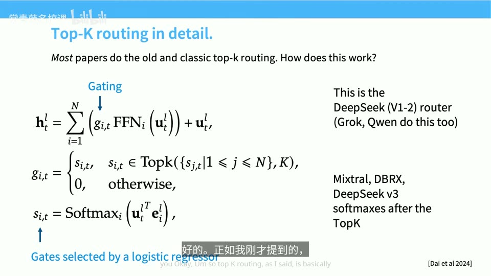
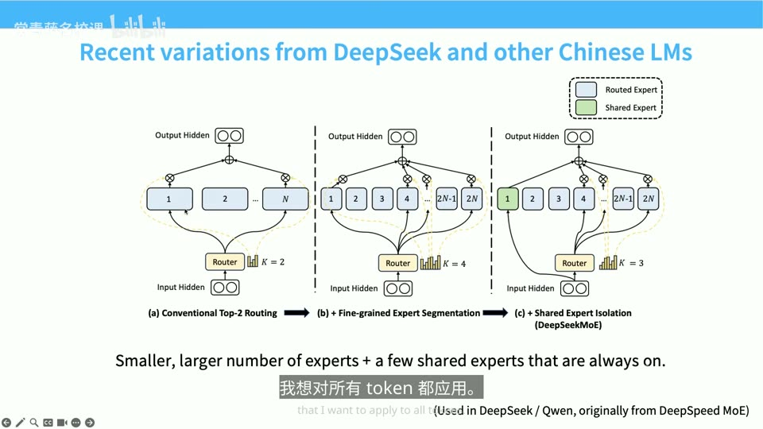
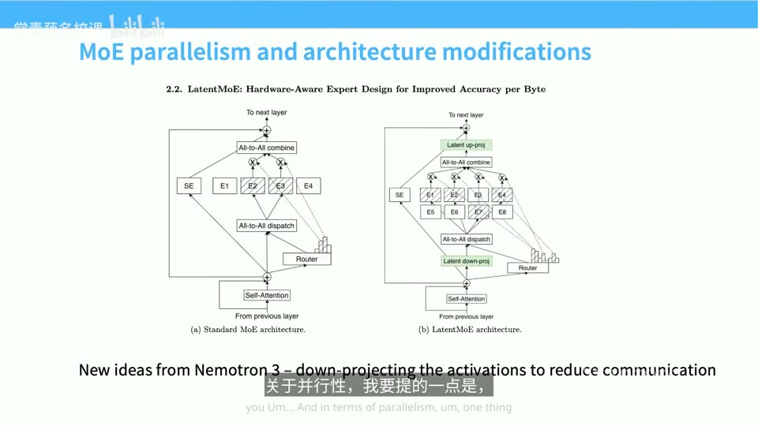

# CS336 Lecture 4：Attention Alternatives 线性注意力&MoE

> 本讲主线：长上下文让全注意力越来越贵；线性、混合与稀疏注意力试图降低这笔开销。模型的另一半——前馈网络——则可以用混合专家（MoE）增加参数容量，同时只计算少数专家。

## 1. 解决核心问题：为什么本讲同时改造 Attention 和 FFN

**背景**：上一篇内容聚焦于Transformer架构，而本篇内容核心聚焦于如何解决「越来越大的上下文需求」的问题。Transformer 块主要有两类计算：Attention 让不同位置交换信息；FFN（前馈网络，也叫 MLP）分别处理每个 token。上下文窗口变长后，模型能读更多资料、处理更长的任务历史。横轴是不同模型、纵轴是上下文窗口大小（对数尺度），顶级模型厂商在竞相提供越来越大的上下文。

可是如何衡量成本？答案很残酷：注意力是二次方的。

**冲突**：在序列较短时，网络的 feedforward（前馈）部分开销更大、且随长度线性增长，因此对于小模型而言FFN是主要开销；但Attention是所有位置之间的 all-to-all 连接，复杂度是 O(N²)。随着序列变长（即上下文变长），Attention会迅速超过 feedforward 成为主要开销。[【跳转到 00:35】](https://www.bilibili.com/video/BV11LEA6eEuj/?p=4&t=35)


**疑问**：如果我们想处理十万、甚至上百万 token 的上下文，有没有办法让计算量随序列长度变成线性依赖？即便做不到完全线性，是否存在办法在不牺牲太多性能的前提下大幅降低成本？另外，Transformer 的另一半——MLP 层——有没有更高效的实现方式？

**核心回答**：在本篇课程中，我们会学习两种处理方式：一种方式减少 Attention 必须读取或比较的信息，即利用矩阵乘法的结合律，去掉 softmax 后把 QKᵀV 重新结合成 Q(KᵀV)，从而将对序列长度的依赖从二次降为线性（这就是线性注意力，它同时具备"密集并行"与"RNN 循环"两种形式）；在此基础上加门控得到 Mamba-2、再加投影擦除得到 Gated DeltaNet，最终以"线性层 + 少量全注意力层"的混合架构落地。另一种方式是让 FFN 拥有更多参数、每次却只激活一部分（即MoE）。用混合专家（MoE）的稀疏路由，在 FLOPs 不变的前提下把参数量放大数倍。目前，这两种方式在生产环境中均得到验证。本讲把它们分别展开：

```text
长上下文成本
├─ Attention：全局两两比较 → 线性状态 / 混合层 / 稀疏选择
└─ FFN：每次使用全部参数 → MoE 路由到少数专家
```

一个反计算机科班的直觉是：常数因子其实非常重要（相较于O notation，线性or二次方）。在本讲课程中，对context成本影响最大的进展是Flash Attention，在后续的课程中会系统介绍这一点。Flash Attention会将Attention的计算方式优化成对系统更加友好的方式，这样能为Attention的性能带来“惊人”的提升。


这两条路线可以同时出现在一个模型中；它们解决的是不同的成本。我们可以先看 Attention的处理方式。

## 2. 线性注意力的起点：矩阵乘法的交换律

**结论**：注意力之所以是二次的，是因为先算 QKᵀ 得到 N×N 的大矩阵；我们可以参考乘法交换律，只要允许重新结合括号、先算 KᵀV，计算量就只依赖头维度而非序列长度。[【跳转到 02:53】](https://www.bilibili.com/video/BV11LEA6eEuj/?p=4&t=173)

### 如何将注意力二次方的计算方式化简为线性
要理解所有"线性时间注意力"方案，只需先抓住一个核心思想：乘法的结合律。回顾注意力的紧凑写法——由 Q、K、V 组成：

1. 先让 Q 和 K 做 all-to-all 交互：计算 QKᵀ。这个矩阵的大小是 N×N，正是二次复杂度的来源（N 动辄数百万，也就是上下文长度）。
2. 用 softmax 对这一行做归一化。
3. 再和值 V 相乘，得到注意力输出。

例如把长度从 `n` 增至 `2n`，全注意力的位置对数量约从 `n²` 增至 `4n²`。即使单个位置对计算得更快，足够长的上下文仍会遇到成本压力。局部或滑动窗口注意力是另一种办法：多数层只看附近位置，少数层保留全局视野；它已经在 Lecture 3 讨论过。[【跳转到 03:18】](https://www.bilibili.com/video/BV11LEA6eEuj/?p=4&t=198)

**[【跳转到 04:51】](https://www.bilibili.com/video/BV11LEA6eEuj/?p=4&t=291)

先考虑一个不带 softmax 的教学版本：

```text
(QKᵀ)V = Q(KᵀV)
左结合：先产生 n×n          右结合：先产生 d_k×d_v
```

现在，先暂时"忘掉"softmax、把那一行去掉。如果没有 softmax，我们就可以改变这个操作的复杂度。 原本要做 QKᵀ 再乘 V，现在改成右结合——先算 Kᵀ 与 V 相乘，再与 Q 相乘。经过这种"重排序（括号移动）"后，二次的部分就消失了：我们不再需要 N² 项，取而代之的是依赖维度 D、头维度 d_k 和 V 的 d_v。理论上这些维度可以很大，但它们通常只在几千到几万的量级——没人会在隐藏/头维度里设置百万级的坐标。所以相比 N²，这一项的依赖关系"友好得多"。


课堂问答特别澄清了一个易混点：从 softmax 注意力到线性形式的这一步是有损的（我们丢掉了 softmax）；但从"线性形式"到下面要讲的"循环形式"的等价性是精确无损的。这很关键——它意味着"线性化"的代价只发生一次。

## 3. 线性注意力双重角色：训练时用并行方式，推理时用RNN
一句话结论：KᵀV 可以写成一种 RNN 式的增量更新形式；于是同一套参数既能用密集并行矩阵乘法训练，又能用固定大小的状态做推理，兼得两者之长。

### 3.2 自回归模型只能读过去，因此每个位置要用自己的前缀状态

上面的 `KᵀV` 是全序列求和；若直接用于语言模型，第一个 token 也会看到未来。带因果约束的简化写法是：

```text
S₀ = 0
Sₜ = Sₜ₋₁ + kₜ vₜᵀ     # 当前 key/value 写入状态
yₜ = Sₜᵀ qₜ             # 当前 query 读取截至 t 的状态
```

这里 `Sₜ` 的 shape 是 `[d_k,d_v]`，不随已经读过的 token 数 `t` 增长。这就把历史信息压进一个固定大小的矩阵；实际模型还会加入输出门或归一化等细节。[【跳转到 06:31】](https://www.bilibili.com/video/BV11LEA6eEuj/?p=4&t=391)


### 3.3 同一个线性模型可用并行形式训练、循环形式解码
重排之后，右侧那个矩阵乘法（令 S = KᵀV）看起来就像一个 RNN：不必写成"密集形式"，而是可以在从左到右遍历上下文时增量地书写——把 K 和 V 相乘、更新这个状态 S、累加到之前的状态上，再与 Q 相乘得到输出。数学家会说：这种"密集形式"与"RNN 形式"在某种意义上是等价的。【跳转到 06:06】

训练时可以对各位置的前缀状态做并行计算；生成时则每来一个 token 更新一次 `Sₜ`。这给了它类似 Transformer 的训练并行性，也给了它类似 RNN（循环神经网络）的固定状态解码方式。[【跳转到 07:21】](https://www.bilibili.com/video/BV11LEA6eEuj/?p=4&t=441)

- RNN 的优点在推理：你有一个大小固定的状态 S，不断把它向前传递。推理时代价与序列长度无关，非常理想。
- 线性注意力的优点在训练：你可以用"密集（并行）形式"，它天生并行，对训练非常有利。

**两种“等价”不能混淆**：原始 softmax 注意力改成线性机制会改变模型；选定一个线性机制以后，它的并行与循环写法才可能在数学上等价。省掉完整历史 KV 缓存，也意味着有限状态必须概括长上下文；需要逐字找回早期细节时，压缩可能带来损失。[【跳转到 17:07】](https://www.bilibili.com/video/BV11LEA6eEuj/?p=4&t=1027) · [【跳转到 27:22】](https://www.bilibili.com/video/BV11LEA6eEuj/?p=4&t=1642)

## 4. Mamba-2 和 Gated DeltaNet 用门控决定状态怎样保留、擦除与写入

**线性状态并非只能累加**。若状态一直累加而不遗忘，旧信息可能持续占位。课堂用 Mamba-2 说明“衰减门”：简化为 `Sₜ ≈ γₜ Sₜ₋₁ + kₜvₜᵀ`，其中 `γₜ` 由当前输入决定，用来调节旧状态保留多少。这个式子只表达主要直觉，并非完整的 Mamba-2 实现。[【跳转到 10:03】](https://www.bilibili.com/video/BV11LEA6eEuj/?p=4&t=603)


Gated DeltaNet 增加写入门 `βₜ`，还会在写入某个 key 对应的新内容时，削弱状态中该 key 方向的旧内容。幻灯片中出现类似 `(I−βₜkₜkₜᵀ)Sₜ₋₁` 的项：可以把它想成“先擦旧记录，再写新记录”。只有在恰当的归一化和参数条件下，它才是严格的正交投影；这里把“投影擦除”当作帮助理解的直觉。[【跳转到 13:30】](https://www.bilibili.com/video/BV11LEA6eEuj/?p=4&t=810)


这类更新与快速权重编程、在线学习或测试时训练中的一些方法相似。讲师强调：若门控只依赖输入、没有复杂的状态依赖，往往仍能构造适合训练的并行计算形式；具体是否成立取决于更新规则，不能把它当作任意 RNN 的通用性质。[【跳转到 11:50】](https://www.bilibili.com/video/BV11LEA6eEuj/?p=4&t=710) · [【跳转到 14:45】](https://www.bilibili.com/video/BV11LEA6eEuj/?p=4&t=885)

## 5. 混合层保留全注意力的检索能力，是实际部署的常见折中

**为什么不全换成固定状态？** 全注意力可以直接从所有历史位置读取信息；固定大小的状态必须压缩历史。状态容量有限时，长上下文中某个具体细节可能难以保留。混合架构因此让多数层使用便宜的线性或状态空间机制，每隔几层安排一层完整 softmax 注意力。[【跳转到 08:50】](https://www.bilibili.com/video/BV11LEA6eEuj/?p=4&t=530) · [【跳转到 27:46】](https://www.bilibili.com/video/BV11LEA6eEuj/?p=4&t=1666)

转录稿举了 **7 个线性层 + 1 个全注意力层**以及 **3 个 Gated DeltaNet 层 + 1 个全注意力层**的模型例子。幻灯片展示：混合模型在所测任务中能保持竞争力，同时提高长上下文解码吞吐；另一组混合比例实验表明，非全注意力层占比继续升高时，性能尤其在检索、问答等任务上可能下降。具体比例是模型设计选择，不是普适最优值。[【跳转到 15:04】](https://www.bilibili.com/video/BV11LEA6eEuj/?p=4&t=904) · [【跳转到 16:26】](https://www.bilibili.com/video/BV11LEA6eEuj/?p=4&t=986)


- 把非全注意力的层统称为 **RNN 层**，从左往右 RNN 层越来越多，性能随之下降。
- 对表现最好的架构（如 Gated DeltaNet 及其变体），在**低 RNN 占比**时**基本没有性能损失**；
- 但一旦超过某个**临界点**，就会出现更明显的性能下降（本例中体现在长上下文性能上）；
- **完全切换到纯 RNN 时，性能下降会变得非常明显**——所有架构都是如此。

[【跳转到 16:01】](https://www.bilibili.com/video/BV11LEA6eEuj/?p=4&t=961)

需要客观看待的是：像"单针检索（needle-in-a-haystack）"这类任务，很多长上下文架构本身就**明确针对它做了优化**；但换成 QA 等更通用的任务，规律依然清晰——**随混合比例升高，性能呈稳定且明确的下降趋势**。[【跳转到 16:26】](https://www.bilibili.com/video/BV11LEA6eEuj/?p=4&t=986)

**算复杂度时也要诚实**：只要仍有全注意力层，整个模型在固定层数配置下仍有随长度二次增长的部分；混合架构主要减少这部分的层数与实际成本。

## 6. DSA（DeepSeek稀疏注意力） 用轻量索引器选位置，再对所选位置做完整注意力

**一句话结论**：DSA 不改变二次复杂度，而是先用一个轻量索引器对全部 token 打分、挑出 top-k 子集，只对这个小子集做全注意力，从而用系统层面的技巧大幅降低实际成本。

另一条路不压缩所有历史，而是只读取可能重要的位置。转录稿介绍的 DeepSeek Sparse Attention（DSA）先用轻量索引器给候选历史位置打分，为每个 query 选出 `top-k`，然后只在这些位置上运行较昂贵的注意力。这与 MoE 的“先选择、再计算”是相似的设计模式。[【跳转到 18:46】](https://www.bilibili.com/video/BV11LEA6eEuj/?p=4&t=1126) · [【跳转到 21:56】](https://www.bilibili.com/video/BV11LEA6eEuj/?p=4&t=1316)


设序列长 `n`，每个查询最终选 `k≪n` 个位置。**完整注意力的昂贵部分**只处理约 `nk` 个被选中的位置对；但这里的索引器仍需为所有候选位置计算分数，在课堂讨论的实现中仍有 `n²` 级的位置对。它的收益来自索引器维度很小、被选中的昂贵计算很少等系统因素，不能简单称为“线性注意力”。[【跳转到 21:40】](https://www.bilibili.com/video/BV11LEA6eEuj/?p=4&t=1300) · [【跳转到 22:33】](https://www.bilibili.com/video/BV11LEA6eEuj/?p=4&t=1353)

课堂还提到一个训练顺序：先预训练普通的较短上下文模型，在长上下文扩展阶段引入索引器并继续训练，而非要求一开始就用稀疏结构。相关图示讨论了预填充与解码的成本，以及与完整注意力接近的实验表现；这仍取决于训练方式和评估任务。[【跳转到 20:01】](https://www.bilibili.com/video/BV11LEA6eEuj/?p=4&t=1201) · [【跳转到 23:32】](https://www.bilibili.com/video/BV11LEA6eEuj/?p=4&t=1412)

课堂问答还讨论低精度：一种思路是用较便宜、较低精度的计算**选择位置**，再对选中的内容进行较高精度的加权计算；讲师同时提醒 softmax 对数值误差敏感。这是对设计空间的讨论，并非课程证明了某种 FP4/FP8 全注意力实现已经可靠。[【跳转到 25:54】](https://www.bilibili.com/video/BV11LEA6eEuj/?p=4&t=1554)

| 路线 | 减少什么 | 要付出的代价 |
|---|---|---|
| FlashAttention | 全注意力的内存搬运和中间存储 | 主要的平方级位置对仍在 |
| 线性或状态模型 | 不保存所有位置对，用固定状态概括历史 | 表达和精确回忆可能受状态容量限制 |
| 混合层 | 减少全注意力层占比 | 仍有部分平方级层 |
| DSA 类稀疏选择 | 昂贵注意力只处理选出的 `k` 个位置 | 索引器仍要扫描候选位置，选择也可能漏信息 |

## 7. MoE 让 FFN 参数增加，但每个 token 只计算少数专家

Attention 之外，本讲的另一半是 **Mixture of Experts（混合专家，MoE）**。这里的“专家”通常是多个 FFN，不是人工标注的医学、法律等职业专家。一个轻量路由器按 token 决定调用哪些 FFN；没有被选中的专家在这次前向计算中不执行。[【跳转到 28:49】](https://www.bilibili.com/video/BV11LEA6eEuj/?p=4&t=1729)


假设原来有一个大小为 `P` 的 FFN，现在放 4 个同样大小的专家、每个 token 只选 1 个：**FFN 总参数约变成 `4P`，每个 token 的专家计算仍约为一个 FFN 的量**。若选 `k` 个专家，就要算 `k` 个；再加上路由、通信等开销，整个模型的 FLOPs、内存和延迟并不会严格保持不变。讲师引用的模型对比显示，在一些固定计算预算下增加专家数能改善损失，因此稀疏参数有实际价值。[【跳转到 29:39】](https://www.bilibili.com/video/BV11LEA6eEuj/?p=4&t=1779) · [【跳转到 30:54】](https://www.bilibili.com/video/BV11LEA6eEuj/?p=4&t=1854)


MoE 还提供**专家并行**：把不同专家放在不同设备，再把 token 的激活值送往相应设备。这有助于放大模型，也引入设备间通信与负载不均的问题；是否划算取决于硬件和网络拓扑。[【跳转到 32:59】](https://www.bilibili.com/video/BV11LEA6eEuj/?p=4&t=1979) · [【跳转到 34:49】](https://www.bilibili.com/video/BV11LEA6eEuj/?p=4&t=2089)

讲师提到把 MoE 也用到 Attention 的研究，但本讲讨论的主流设计是**替换 FFN**；训练与部署 MoE 的复杂度，也是它没有更早普及的重要原因。[【跳转到 38:20】](https://www.bilibili.com/video/BV11LEA6eEuj/?p=4&t=2300) · [【跳转到 39:00】](https://www.bilibili.com/video/BV11LEA6eEuj/?p=4&t=2340)

## 8. 路由器负责“选谁”，共享专家负责每个 token 都需要的处理

### 8.1 Top-k 是常见的 token 级路由

大多数课堂讨论的 MoE 让**每个 token 选择专家**：输入向量 `x` 与各专家的路由向量做内积，得到分数；从中取最高的 `k` 个专家，再用门控权重合并它们的输出。也可以反过来让专家选 token，或求全局最优分配，但前者在课堂介绍的模型里更常用，后两者有性能或实现成本上的取舍。[【跳转到 40:20】](https://www.bilibili.com/video/BV11LEA6eEuj/?p=4&t=2420) · [【跳转到 43:35】](https://www.bilibili.com/video/BV11LEA6eEuj/?p=4&t=2615)

```text
s = x W_router                  # 对每个专家打分
I = top_k(s)                    # 选 k 个专家
y = Σ_{i∈I} g_i · FFN_i(x)      # 合并被选专家的输出
```

`g_i` 是归一化或门控后的权重；具体实现可能在 top-k 前后采用 softmax 或 sigmoid，不能把这段示意代码当成所有模型的精确公式。[【跳转到 44:30】](https://www.bilibili.com/video/BV11LEA6eEuj/?p=4&t=2670)



### 8.2 共享专家和细粒度专家改变了专家的分工

DeepSeek-MoE 相关设计把部分专家拆得更小、更细粒度，同时安排**共享专家**始终参与每个 token 的计算；其余专家仍按路由器的 top-k 选择。直觉是把通用处理交给共享专家，让被路由专家有空间学不同的处理方式。共享专家每次都运行，所以会增加固定计算；部署时可复制共享专家，用额外内存减少通信。[【跳转到 45:31】](https://www.bilibili.com/video/BV11LEA6eEuj/?p=4&t=2731) · [【跳转到 48:27】](https://www.bilibili.com/video/BV11LEA6eEuj/?p=4&t=2907)



课堂展示的消融实验支持细粒度专家在相关设置中的收益；**共享专家的收益证据并非完全一致**，另一项受控研究在其设定下没有测出同样明显的增益。因此应把它当作经过广泛采用的设计选择，而不是所有任务上必胜的结论。[【跳转到 46:38】](https://www.bilibili.com/video/BV11LEA6eEuj/?p=4&t=2798) · [【跳转到 46:58】](https://www.bilibili.com/video/BV11LEA6eEuj/?p=4&t=2818)

## 9. 负载均衡防止少数专家包揽所有 token

**MoE 的训练难点在于选中才计算**。Top-k 是离散选择，没被选中的专家不会收到这次输入的训练信号；热门专家更常被选中、又得到更多训练机会，可能形成正反馈，最终出现**专家坍缩或专家饥饿**：少数专家很忙，其余专家闲置。[【跳转到 49:08】](https://www.bilibili.com/video/BV11LEA6eEuj/?p=4&t=2948) · [【跳转到 52:53】](https://www.bilibili.com/video/BV11LEA6eEuj/?p=4&t=3173)

常见办法是额外加一个**负载均衡损失**。课堂用 Switch Transformer 的形式说明：令 `f_i` 为一批 token 中实际分给专家 `i` 的比例，`P_i` 为路由器给专家 `i` 的平均概率质量，辅助项大致与 `N·Σ_i f_iP_i` 成正比。把 `f_i` 看作本次计算中的固定统计量，对 `P_i` 的直接惩罚会随专家负载增大：越忙的专家，越不该继续被无节制地加分。[【跳转到 53:18】](https://www.bilibili.com/video/BV11LEA6eEuj/?p=4&t=3198)


幻灯片中的消融展示：去掉均衡项后，训练和验证损失变差，几乎所有 token 只流向少数专家；保留均衡项时，专家利用更分散。这里展示的是特定实验，不意味着均衡系数越大越好；过强的均衡约束也可能妨碍模型按任务需要分工。[【跳转到 56:38】](https://www.bilibili.com/video/BV11LEA6eEuj/?p=4&t=3398) · [【跳转到 59:12】](https://www.bilibili.com/video/BV11LEA6eEuj/?p=4&t=3552)


专家被分到不同设备后，还要关心**设备级负载**：每个专家看似均衡，不一定保证网络和设备都高效。课程介绍了专家级、设备级辅助目标，以及在线调整专家偏置等后续办法；“无辅助损失均衡”不等于完全不需要其他限制。[【跳转到 55:23】](https://www.bilibili.com/video/BV11LEA6eEuj/?p=4&t=3323) · [【跳转到 56:13】](https://www.bilibili.com/video/BV11LEA6eEuj/?p=4&t=3373)

## 10. MoE 的系统与训练成本需要一起计算

| 问题 | 为什么出现 | 课堂提到的处理方式 |
|---|---|---|
| 专家间通信 | token 要移动到专家所在设备 | 合理放置专家；发送前把路由激活投影到较低维，接收后再升维 |
| 很多小矩阵乘法 | 每个专家拿到的 token 可能不多 | 把计算组织成分组或结构化稀疏的较大计算 |
| 热门专家排队 | 某些专家收到过多 token | 改进调度与无丢弃实现，避免静默丢 token |
| 路由器数值不稳 | 路由打分与 softmax 对精度敏感 | 更高精度计算路由；在适用设置下加 z-loss |
| 下游微调过拟合 | 专家参数多，小数据集难以覆盖 | 选择性微调非 MoE 部分，或增加训练数据 |

这些处理手段分别对应**通信、利用率、正确性、稳定性与泛化**，不能只看“激活参数少”就推断推理一定便宜。幻灯片举了在发送激活前降维的方案：共享专家保留较宽的表示，被路由专家只接收较窄的表示，以节省 all-to-all 通信。[【跳转到 60:43】](https://www.bilibili.com/video/BV11LEA6eEuj/?p=4&t=3643) · [【跳转到 61:56】](https://www.bilibili.com/video/BV11LEA6eEuj/?p=4&t=3716)



讲师还介绍 **upcycling**：复制一个已训练稠密模型中的 FFN，组成多个专家，新增路由器，再继续训练。这样能复用已有权重，在一些早期模型和实验中优于继续训练原稠密模型；它仍需要后续训练，不是免费获得一个成熟 MoE。[【跳转到 65:59】](https://www.bilibili.com/video/BV11LEA6eEuj/?p=4&t=3959)

## 11. DeepSeek 的演进说明架构选择也受系统约束

课程用 DeepSeek 的几代设计串联本讲：早期 MoE 采用细粒度、共享专家与 token 路由；后续版本扩展专家规模，并显式处理设备负载与通信；再后续版本调整专家加权与均衡机制。重要的是看**为什么需要这些变化**，而不是背每个版本的具体专家数量。[【跳转到 68:29】](https://www.bilibili.com/video/BV11LEA6eEuj/?p=4&t=4109) · [【跳转到 69:19】](https://www.bilibili.com/video/BV11LEA6eEuj/?p=4&t=4159)

最后两项是**整模型中相邻但不同的机制**，并非 MoE 路由本身：

- **MLA（多头潜在注意力）** 把需要缓存的 K/V 内容压缩为较低维的潜在表示，在解码时减少缓存；位置编码与压缩内容的配合还需单独处理。这属于 Attention 侧。[【跳转到 70:09】](https://www.bilibili.com/video/BV11LEA6eEuj/?p=4&t=4209)
- **MTP（多 token 预测）** 让训练目标涉及不止一个未来 token，并可为某些解码加速方法提供候选。它属于预测与推理侧，不能直接归入 MoE 专家设计。[【跳转到 70:34】](https://www.bilibili.com/video/BV11LEA6eEuj/?p=4&t=4234)


至于再往后走，讲师没有给出确定的新架构配方，而是提出一个方向：让模型在后训练中更主动地管理上下文，例如把压缩、检索与模型内部机制结合。这里是展望，不能当作 Lecture 4 已验证的方法。[【跳转到 25:23】](https://www.bilibili.com/video/BV11LEA6eEuj/?p=4&t=1523)

## 12. 用四个问题检查是否真正理解

1. **复杂度**：为什么 `softmax(QKᵀ)V` 不能直接改写为 `Q(KᵀV)`？带因果约束时又为何需要每个位置自己的前缀状态？
2. **信息容量**：固定大小状态省掉了什么成本，为什么混合模型还要保留一部分全注意力层？
3. **稀疏选择**：DSA 和 MoE 都使用 top-k，它们分别在选择“历史位置”和“FFN 专家”时省掉了哪部分昂贵计算？
4. **系统权衡**：为什么 MoE 的参数量与激活 FLOPs 可以分离，却仍要为通信、负载均衡和路由稳定性付费？

这四个问题把本讲串成一条线：**用选择或压缩减少单次计算，再为被压缩的信息和被选择的计算补上能力、训练与系统方面的代价**。

## 关键术语速查

| 术语 | 一句话解释 |
|---|---|
| 全注意力 | 每个查询位置与可见历史位置计算分数；长序列中位置对数量约为平方级。 |
| FlashAttention | 重排全注意力计算、减少显存读写和中间矩阵存储的实现方法。 |
| 线性注意力 | 用可重排的计算和固定维度状态，使长度依赖在适用条件下接近线性的一类机制。 |
| 前缀状态 `Sₜ` | 到位置 `t` 为止，由历史 Key/Value 更新得到的固定大小矩阵。 |
| Mamba-2 | 可从门控状态更新理解的一类状态空间模型，简化直觉是旧状态按输入相关门控衰减。 |
| Gated DeltaNet | 通过门控控制写入，并削弱当前 key 方向旧信息的状态更新机制。 |
| 混合架构 | 把较便宜的线性或状态层与少量完整注意力层交替使用。 |
| DSA | 先由轻量索引器选位置，再对选中的历史位置做较昂贵的注意力。 |
| MoE | 由路由器为 token 选择少数 FFN 专家，增加总参数但限制单次激活计算。 |
| Top-k 路由 | 对候选专家或位置打分，只选分数最高的 `k` 个进行后续计算。 |
| 共享专家 | 不经过稀疏选择、每个 token 都会执行的专家。 |
| 专家坍缩 | 路由集中到少数专家，其余专家缺少训练和利用的现象。 |
| 负载均衡损失 | 鼓励 token 更均匀地分配到专家或设备的辅助训练目标。 |
| 专家并行 | 把专家分到不同设备，并在设备间传送路由后的 token 激活。 |
| Upcycling | 从已训练的稠密模型复制专家权重，新增路由并继续训练 MoE。 |
| MLA | 把部分 KV 信息压缩为低维潜在表示，以减少解码缓存。 |
| MTP | 训练时预测多个未来 token，可与部分解码加速方案结合。 |
