# CS50x Lecture 4：内存、指针与文件（视频图文笔记）

> 本讲的主线是：变量占据内存中的位置；指针保存位置；访问、复制和释放内存时，必须分清「地址」与「地址里的值」。这条线最终连到字符串、函数参数、用户输入和文件读写。

## 阅读说明与来源

- **视频**：[CS50x 2026 中文配音版第 6 分集：Lecture 4 内存](https://www.bilibili.com/video/BV1Lt6qBcExg/?p=6)。本文配图截自该分集，时间链接跳转到视频对应位置。
- **文字依据**：[官方英文定时字幕](https://cdn.cs50.net/2025/fall/lectures/4/lang/en/lecture4.srt)、仓库里的[英文讲稿](../transcripts/lecture4.txt)及[幻灯片](../slides/lecture4.pdf)。中文配音的独立字幕未取得，术语和示例用这些官方材料核对。
- **代码依据**：[Week 4 课堂源码](../source/src4/)。课堂文件包含故意写错的版本，用来展示指针错误、越界和内存泄漏；下文会明确指出哪些代码不能照搬。

## 本讲要解决的核心问题

前几周我们能用 `int`、`string` 和 `get_string` 写程序，却很少关心数据存在哪里。到了字符串复制、交换变量和读写文件时，仅知道「变量里有个值」已经不够：**那个值是整数、地址，还是一段数据的起点？两个名字是不是指向同一块内存？**

本讲给出一套贯穿全程的判断方法：先找对象实际存放的位置，再看指针保存了哪个地址，最后看程序是否有权读写那个地址、那块内存是否仍然有效。

## 一、十六进制让字节和地址更容易读

视频从图片切入：屏幕上的图由像素组成，像素的颜色可以用红、绿、蓝三个分量表示。一个分量若用 8 位存储，就有 `0` 到 `255` 共 256 种取值。十六进制用 `0–9` 和 `A–F` 表示 16 个数字，所以 **两个十六进制位恰好能写出一个字节**：`0x00 = 0`，`0xFF = 255`。例如 RGB 的 `#FF0000` 表示红色分量最大、绿色与蓝色分量为零。[【视频 10:00】](https://www.bilibili.com/video/BV1Lt6qBcExg/?p=6&t=600)

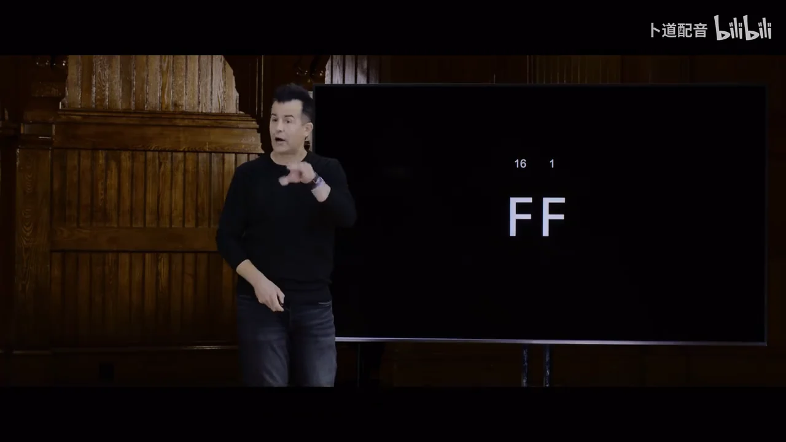

十六进制也常用于书写内存地址。前缀 `0x` 是记数方式的标记，因此 `0x10` 是十进制的 16。地址可以很长，但不必把它换算成十进制；读指针代码时，关键是看**两个地址是否相同、它们指向哪块存储空间**。[【视频 15:00】](https://www.bilibili.com/video/BV1Lt6qBcExg/?p=6&t=900)


## 二、`&` 取地址，`*` 沿地址访问值

课堂的 [`addresses0.c` 到 `addresses3.c`](../source/src4/addresses0.c) 是一条连续的推导。先把整数 `50` 放入变量 `n`，然后取得 `n` 的地址，最后把该地址交给指针 `p`：

```c
int n = 50;
int *p = &n;
printf("%i\n", *p);
```

`&n` 是 **`n` 的地址**；`p` 存放这个地址；表达式 `*p` 则去该地址读取一个 `int`，因此打印 `50`。声明里的 `int *p` 表示「`p` 是指向 `int` 的指针」，表达式里的 `*p` 表示「取出它指向的 `int`」。相同符号出现在不同语法位置，作用不同。[【视频 26:00】](https://www.bilibili.com/video/BV1Lt6qBcExg/?p=6&t=1560)

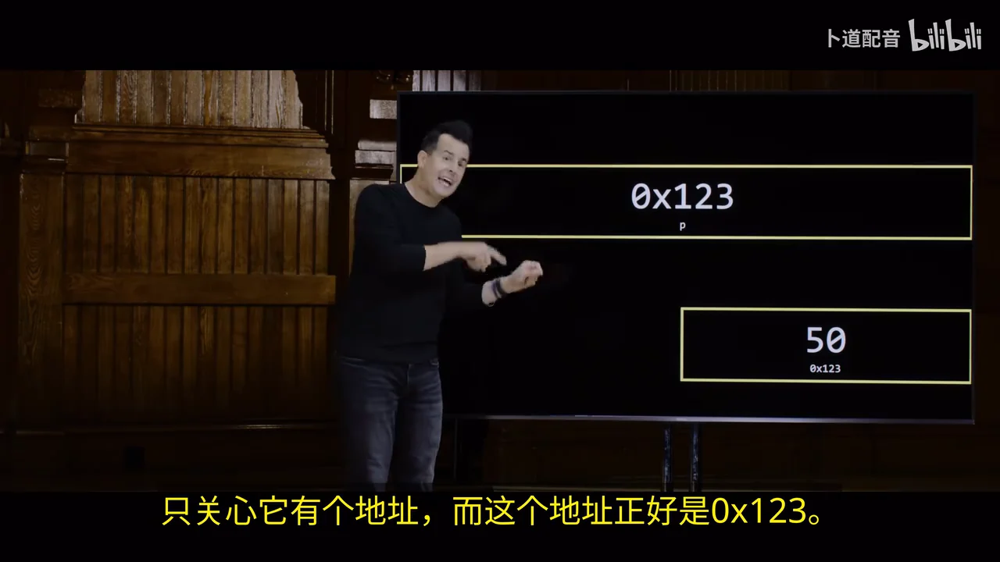

| 表达式 | 这里代表什么 |
|---|---|
| `n` | 整数 `50` |
| `&n` | 存放 `n` 的地址 |
| `p` | 指针变量里保存的地址；此处等于 `&n` |
| `*p` | `p` 指向位置里的整数；此处等于 `50` |

视频在教学环境里以 **64 位机器的指针通常占 8 字节**为例。这说的是一个指针值的存储宽度，不是「机器只有 8 GB 内存」；实际可用内存还受处理器、操作系统及硬件限制。地址的具体数字也不是程序可以固定依赖的常量。

## 三、C 字符串是一段以 `\0` 结尾的字节序列

以前写的 `string s = "HI!"` 在 CS50 库里是 `char *` 的别名；`s` 保存的是第一个字符的位置。内存里依次有 `H`、`I`、`!` 和结尾的 `\0`。结尾字节让需要处理字符串的函数知道在哪里停下，不属于屏幕上可见的三个字符。这里的 `"HI!"` 是字符串字面量，不能把它当成可任意修改的缓冲区。[【视频 35:00】](https://www.bilibili.com/video/BV1Lt6qBcExg/?p=6&t=2100)

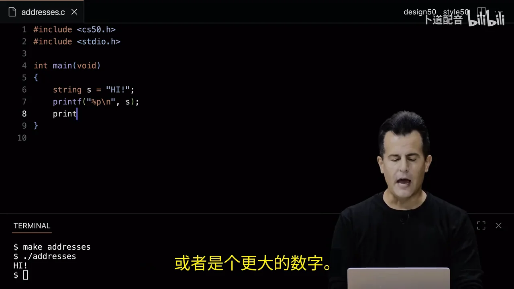

[`addresses7.c` 到 `addresses10.c`](../source/src4/addresses7.c) 继续展示地址与字符的关系：`s[1]` 和 `*(s + 1)` 都是字符 `I`；把 `s + 1` 当作字符串起点交给 `%s`，得到的则是 `I!`。这里的 `+ 1` 按**所指元素的大小**移动：`char *` 向后一个字符；如果是 `int *`，向后一个 `int`，通常跨过 4 字节。指针算术不能用来任意访问不属于该对象的内存。

## 四、比较地址与比较内容会得到不同问题的答案

[`compare1.c`](../source/src4/compare1.c) 从用户读取两次字符串，再用 `s == t` 比较。如果两次都输入 `HI`，字符内容相同，但两次输入通常保存在不同位置，`s` 和 `t` 保存的地址不同，所以程序会输出 `Different`。这段代码并没有回答「两个词是否一样」。[【视频 55:00】](https://www.bilibili.com/video/BV1Lt6qBcExg/?p=6&t=3300)


要比较文字，改用 [`compare2.c`](../source/src4/compare2.c) 中的 `strcmp(s, t) == 0`；返回零表示对应字符依次相同。课堂随后打印两个指针的地址，帮助把「看起来一样」与「存放在同一处」分开。

## 五、复制指针只会共享原数据，真正复制字符串需要新空间

[`copy0.c`](../source/src4/copy0.c) 写 `string t = s;`，复制的是地址。此时 `s` 和 `t` 指向同一串字符；执行 `t[0] = toupper(t[0]);` 后，再打印 `s` 也会看到首字母改变。[【视频 60:30】](https://www.bilibili.com/video/BV1Lt6qBcExg/?p=6&t=3630)

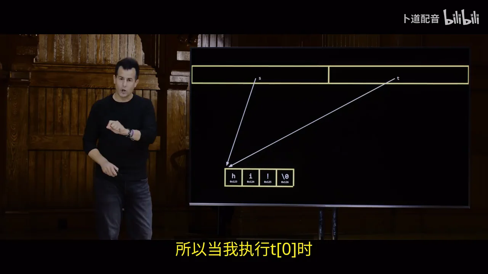

如果希望改 `t` 而不改 `s`，要分配另一块空间，并把**字符连同结尾的 `\0` 一起复制**。长度为 3 的 `HI!` 需要 4 个字节；`malloc(strlen(s) + 1)` 中的 `+ 1` 正是留给终止符。中间版本用循环逐字节复制，后面改用 `strcpy`。[`copy5.c`](../source/src4/copy5.c) 再补上 `NULL` 检查、空字符串检查和 `free(t)`。[【视频 71:00】](https://www.bilibili.com/video/BV1Lt6qBcExg/?p=6&t=4260)

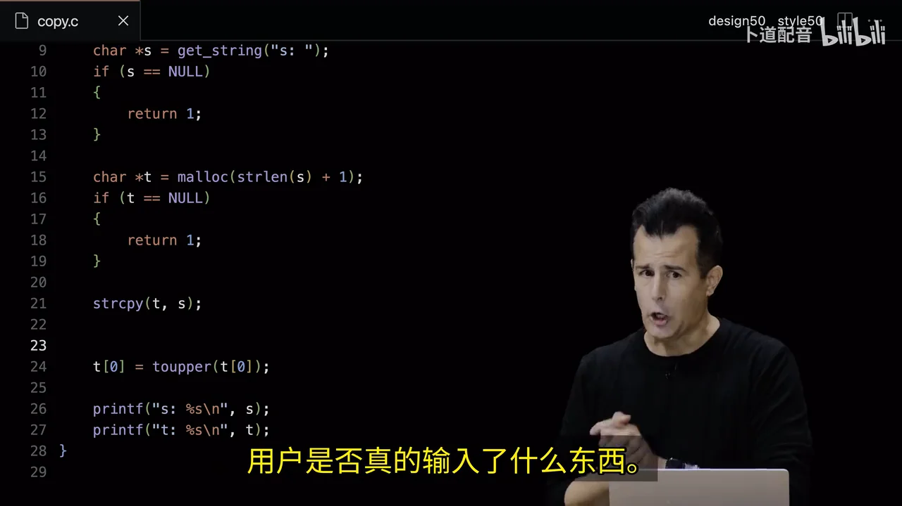

这一步的关键不是背 `malloc`、`strcpy`、`free` 三个名字，而是跟踪 **谁拥有这块新内存，以及最后由谁释放**。分配失败时 `malloc` 返回 `NULL`，不能立即把它当作可写地址使用；释放之后，也不能继续解引用旧指针。

## 六、越界、泄漏与未初始化指针是三种不同的错误

[`memory.c`](../source/src4/memory.c) 故意分配了三个 `int` 的空间，却写入 `x[3]`。三个合法下标是 `0`、`1`、`2`；`x[3]` 已跨出分配范围。此外，这段代码没有 `free(x)`。课堂借此展示 Valgrind 报告的**非法写入**与**内存泄漏**：前者是访问了不属于这块对象的位置，后者是程序丢掉了一块已分配内存的管理机会。[【视频 79:00】](https://www.bilibili.com/video/BV1Lt6qBcExg/?p=6&t=4740)

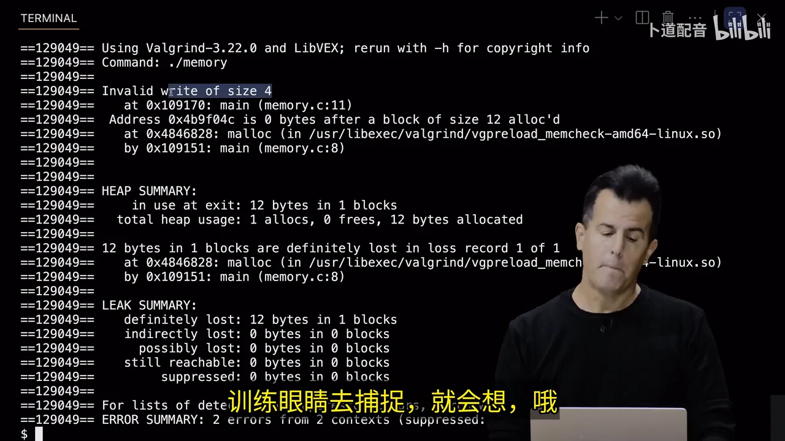

[`garbage.c`](../source/src4/garbage.c) 读取未初始化的局部数组，显示所谓的「垃圾值」。这些值没有可靠含义，也不能指望它们总是零。更严重的是未初始化指针：

```c
int *x;
int *y;
*x = 13;  // 错：x 尚未指向可用的 int
*y = 52;  // 错：y 也一样
```

`int *x` **只创建一个装地址的变量**，没有自动创建它所指向的整数。视频用指针动画解释这点：只有先让指针指向现有整数，或成功分配一块足够的内存，才能经 `*x` 写值。[【视频 87:00】](https://www.bilibili.com/video/BV1Lt6qBcExg/?p=6&t=5220)

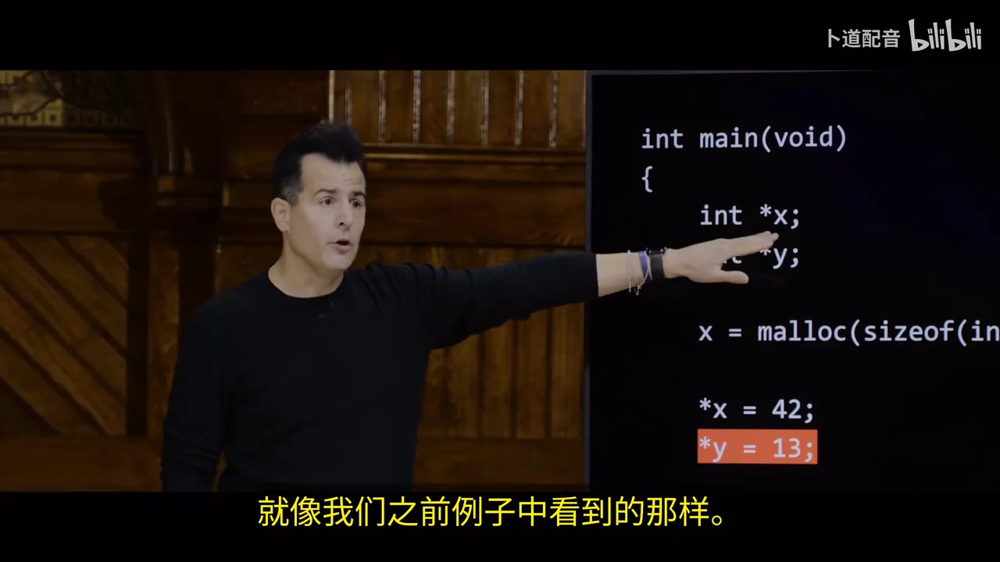

## 七、交换变量要把原变量的地址传进函数

[`swap0.c`](../source/src4/swap0.c) 的 `swap(int a, int b)` 交换了函数**自己的参数副本**，`main` 里的 `x` 和 `y` 仍是原值。视频先用倒水需要第三个杯子的例子解释临时变量，然后用内存中的函数调用说明：仅有 `tmp` 还不够，函数必须能找到调用者原来的变量。[【视频 102:20】](https://www.bilibili.com/video/BV1Lt6qBcExg/?p=6&t=6140)

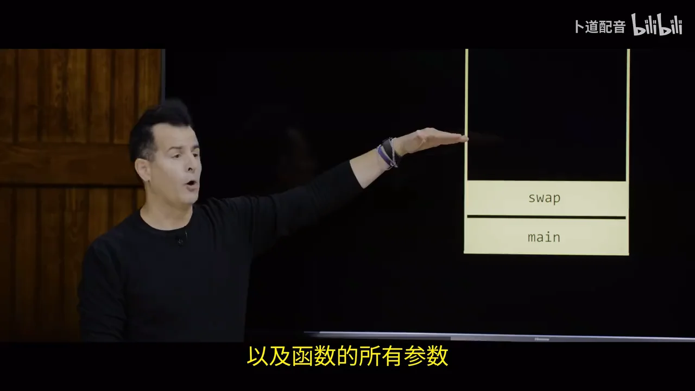

[`swap1.c`](../source/src4/swap1.c) 改成在 `main` 调用 `swap(&x, &y)`，函数接收 `int *a, int *b`，再用 `*a`、`*b` 修改原位置。这样函数得到的仍是参数的**副本**，但副本里装的是原变量的地址，所以能通过地址写回。课程用调用栈（stack）示意函数运行时的局部变量和参数；动态分配的对象则放在堆（heap）中。这幅内存布局是概念图，不要求实际地址严格按图中的方向增长。[【视频 106:00】](https://www.bilibili.com/video/BV1Lt6qBcExg/?p=6&t=6360)

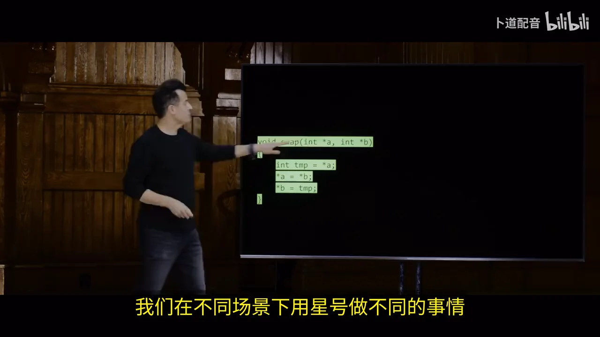

## 八、`scanf` 说明输入函数为什么需要可写地址

[`get1.c`](../source/src4/get1.c) 用 `scanf("%i", &n)` 读取整数：函数需要一个**可写位置**，所以传 `&n`，而不是只传当时的 `n`。视频接着展示两个危险版本：[`get2.c`](../source/src4/get2.c) 的 `char *s;` 没有指向有效缓冲区；[`get3.c`](../source/src4/get3.c) 虽有 `char s[4]`，却用没有宽度限制的 `%s`，输入超过 3 个可见字符就没有足够位置容纳内容和 `\0`。[【视频 116:00】](https://www.bilibili.com/video/BV1Lt6qBcExg/?p=6&t=6960)

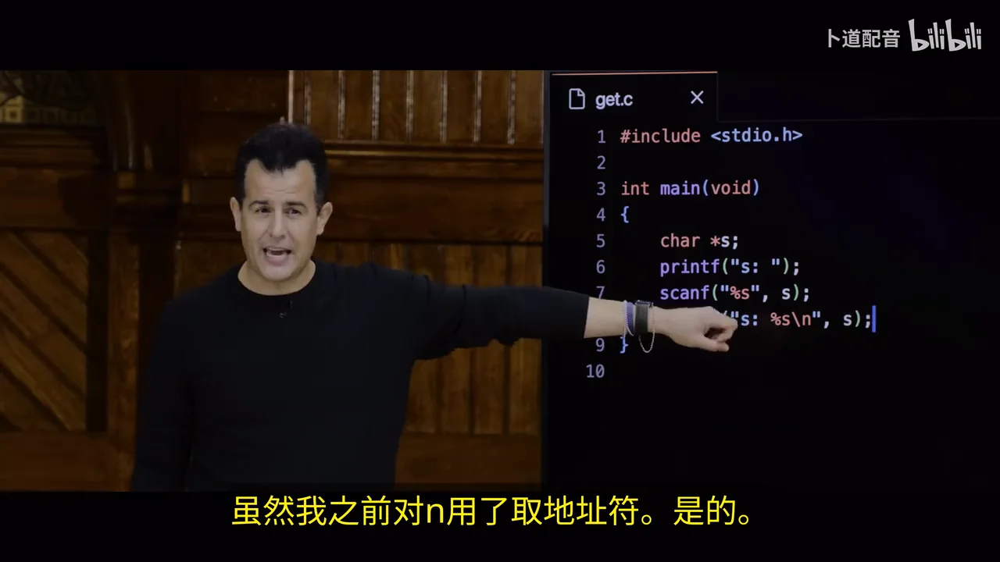

这也说明 CS50 的 `get_string` 帮初学者处理了什么：它要准备并按需扩大存放输入的空间。以后直接使用 C 标准输入接口时，必须自己考虑缓冲区容量、输入失败和终止符。

## 九、文件指针把内存中的程序连到磁盘文件

前面的变量随着程序结束就不再供下次运行使用。文件读写让数据留在磁盘上。[`phonebook1.c`](../source/src4/phonebook1.c) 用 `fopen("phonebook.csv", "a")` 以追加方式打开 CSV 文件，检查是否成功，再用 `fprintf` 写入姓名和号码，最后 `fclose`。`FILE *` 指向 C 运行时管理文件流的对象；它不是把整个磁盘文件直接装进了指针。[【视频 129:00】](https://www.bilibili.com/video/BV1Lt6qBcExg/?p=6&t=7740)

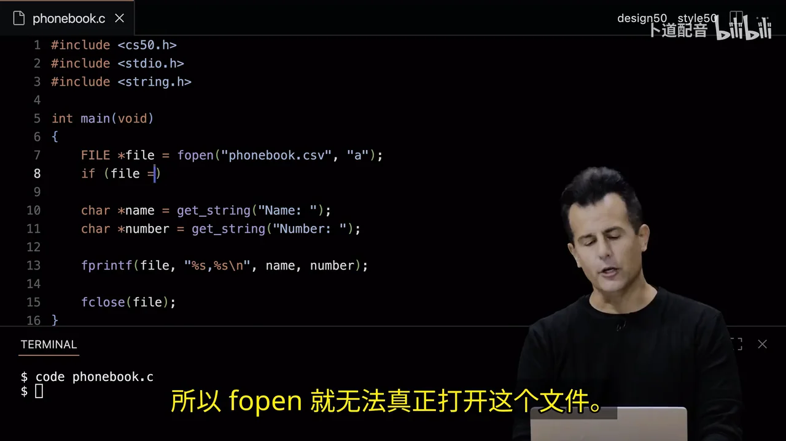

[`cp.c`](../source/src4/cp.c) 更进一步：分别以 `"rb"`、`"wb"` 打开源文件和目标文件；每次 `fread(&b, sizeof(b), 1, src)` 读一个字节，成功时 `fwrite(&b, sizeof(b), 1, dst)` 写出，循环到读不到为止。这里的 `&b` 再次出现，因为读取函数要知道**把读到的字节放在哪里**。[【视频 136:30】](https://www.bilibili.com/video/BV1Lt6qBcExg/?p=6&t=8190)

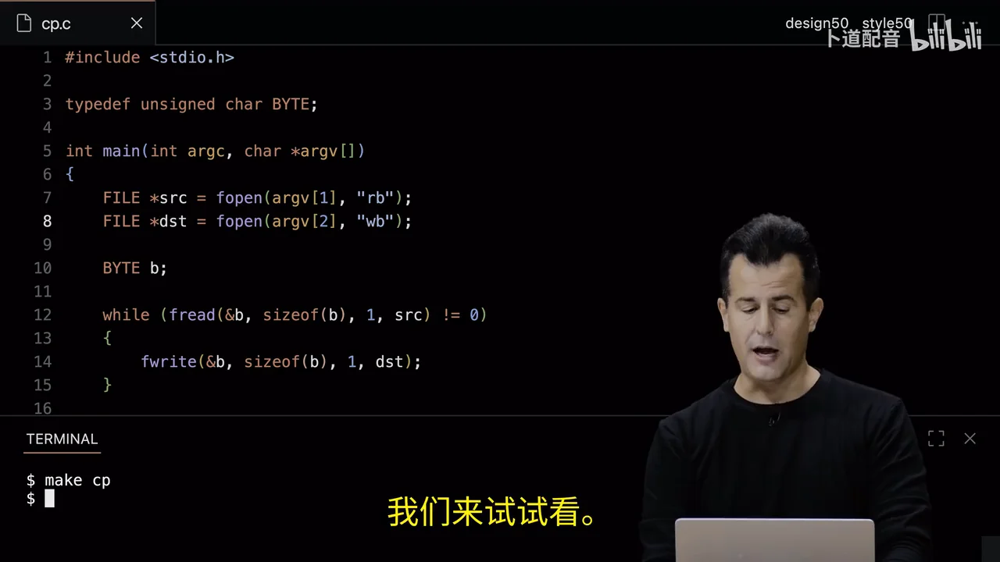

`cp.c` 是课堂演示，不是健壮的复制工具：源码没有先检查命令行参数个数、两次 `fopen` 的返回值，以及写入是否成功。读它时可以先理解字节流，再把这些检查作为现实程序必须补上的部分。

讲座最后回到开头的图像：BMP 等图像文件也由字节组成。逐像素读出颜色、计算新值再写回，就能实现灰度、怀旧色、水平翻转、模糊和边缘检测；文件、数组与内存的知识在 Week 4 的图像题里会合到一起。[【视频 138:50】](https://www.bilibili.com/video/BV1Lt6qBcExg/?p=6&t=8330)


## 把整讲串起来

从 `int n = 50` 到文件复制，视频始终在追问同一件事：**某个函数要处理数据时，它拿到的是数据本身，还是一条通向数据的地址？**

| 场景 | 传递或保存的东西 | 必须额外确认 |
|---|---|---|
| `int *p = &n` | 整数 `n` 的地址 | `p` 指向的对象仍然有效 |
| `string t = s` | 字符串首字符的地址 | `s`、`t` 因此共享原字符 |
| `malloc(...)` | 新分配区域的地址 | 非 `NULL`、容量够用、最后释放 |
| `swap(&x, &y)` | 两个原变量的地址 | 函数通过 `*a`、`*b` 写回 |
| `scanf("%i", &n)` / `fread(&b, ...)` | 输入结果要写入的位置 | 缓冲区有效、容量和返回值正确 |

后面做 Week 4 习题时，可以按这个顺序排查内存问题：**指针从哪里获得地址 → 指向的空间有多大 → 什么时候写入或读取 → 何时释放**。这比只看哪一行出现 `*` 更能找到真正的错误。

> 配图来自所列 B 站分集；文字以官方英文定时字幕、课堂源码和幻灯片核对。视频与字幕的片头片尾有少量时长差异，时间链接指向相近的讲解位置。
