# CS50x Lecture 8：从网络到交互网页（视频图文笔记）

> 一句话主线：浏览器先用网络协议找到服务器并取回网页，随后用 HTML 建立结构、CSS 设置样式、JavaScript 响应用户操作。

## 阅读说明与来源

- **视频**：[CS50x 2026 中文配音版第 10 分集：Lecture 8 HTML, CSS, JavaScript](https://www.bilibili.com/video/BV1Lt6qBcExg/?p=10)。文中的时间链接和截图均对应这一分集。
- **课程文字**：[官方英文定时字幕](https://cdn.cs50.net/2025/fall/lectures/8/lang/en/lecture8.srt)、仓库内的[英文讲稿](../transcripts/lecture8.txt)与[官方幻灯片](../slides/lecture8.pdf)。中文配音没有可用的独立字幕，因此术语和代码以这些课程材料为准。
- **课堂代码**：[Lecture 8 示例源码](../source/src8/)。下文代码仅摘录或简化课堂示例，具体版本可点进源码核对。
- **延伸阅读**：[Lecture 8 基础知识框架](Lecture08_互联网与Web开发_基础知识.md)提供更细的协议、语法和易错点解释。

视频前半段解释浏览器怎样取到网页，后半段才动手写网页。读的时候始终追问两个问题：**这一步在哪台机器上发生？它接收什么，产生什么？**

## 本讲要解决的核心问题

**背景**：之前的 CS50 程序主要在终端运行；日常使用的网页则要跨网络传输，还要在浏览器里显示和响应点击。

**冲突**：只会写一个 HTML 文件，还不知道它怎样从服务器到达浏览器；只会调用网页接口，也无法控制页面长什么样、用户操作后发生什么。

**回答**：把网页看成一条连续的流程：**DNS 找服务器地址 → IP/TCP 传输 → HTTP 请求与响应 → HTML 结构 → CSS 样式 → JavaScript 交互**。每层解决一个不同的问题，合起来才是一个可用的网页。

```text
用户输入网址
  → DNS 查 IP → IP 路由数据包 → TCP 连接到端口
  → 浏览器发 HTTP 请求 → 服务器回 HTML/CSS/JavaScript
  → 浏览器建立页面结构、应用样式、注册交互事件
```

## 一、IP 负责把包送向目标，TCP 负责连接中的次序与可靠性

**网络传送的是数据包（packet）**，不是把一整个网页瞬间搬过去。路由器根据目的地址逐站转发；IP 地址告诉网络包要去哪里，源地址让对方知道回哪里。课堂把这件事比作在信封上写收件人与寄件人。[【视频 09:00】](https://www.bilibili.com/video/BV1Lt6qBcExg/?p=10&t=540)

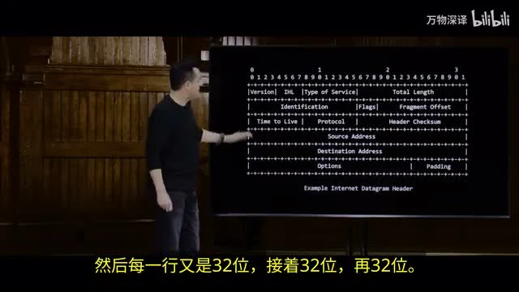

IPv4 地址由 32 位构成，通常写成 `#.#.#.#`；每组是 8 位，所以每组范围为 0–255。实际互联网还会使用 IPv6，不能把“所有设备永远有一个独一无二的公网 IPv4 地址”当成规则。课堂此处的目标是先理解**地址与转发**，不是记住包头的每个位。[【视频 09:00】](https://www.bilibili.com/video/BV1Lt6qBcExg/?p=10&t=540)

同一台服务器可能同时提供网页、邮件等服务。**端口（port）**告诉机器把数据交给哪个服务；课堂举出 Web 常见的 80（HTTP）和 443（HTTPS）。TCP 除了使用端口，还为数据标记顺序、确认收到并处理丢失重传。可以把分工记成：**IP 负责去哪里，TCP 负责这次通信怎样可靠地到达对应程序。**

### DNS 与 DHCP 解决两个不同的“地址问题”

- **DNS**：把 `www.harvard.edu` 这样的域名查成可用于网络通信的地址。它是分层查询与缓存体系，并非一本放在单台服务器上的全球电话簿。
- **DHCP**：设备连上网络时，自动获得本机地址、网关和 DNS 服务器等配置。它回答“我的设备该怎样接入这个网络”。

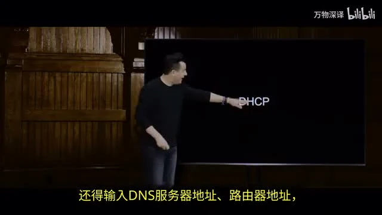

[【视频 17:00：DNS】](https://www.bilibili.com/video/BV1Lt6qBcExg/?p=10&t=1020) · [【视频 21:00：DHCP】](https://www.bilibili.com/video/BV1Lt6qBcExg/?p=10&t=1260)

## 二、HTTP 规定浏览器怎样向服务器“提问”，服务器怎样“回答”

URL 不只是域名。以 `https://www.example.com/folder/file.html` 为例：`https` 是方案，`www.example.com` 是主机名，后面是路径。路径可以指向文件，也可以由服务器程序解释；不能只凭 URL 断定服务器磁盘上一定有同名文件。[【视频 24:00】](https://www.bilibili.com/video/BV1Lt6qBcExg/?p=10&t=1440)

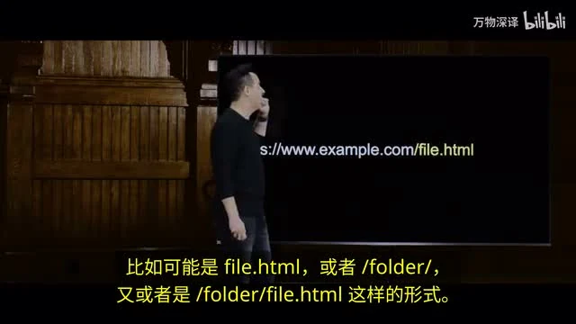

浏览器发出 **HTTP request**，服务器返回 **HTTP response**。请求会说明方法和路径；响应带状态码、响应头和正文。例如课堂用 `curl -I` 只看响应头，观察到 `301 Moved Permanently` 与 `Location`，意思是服务器要求浏览器改去新地址。[【视频 31:30】](https://www.bilibili.com/video/BV1Lt6qBcExg/?p=10&t=1890)

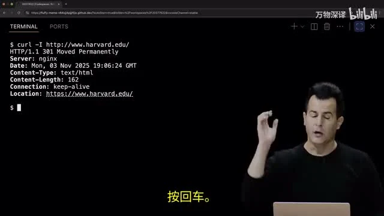

先记住三种结果：`200` 表示请求成功，`301` 表示永久重定向，`404` 表示找不到所请求的资源。打开浏览器开发者工具的 **Network** 面板，可以看见一个页面为了 HTML、CSS、JavaScript 和图片发出了多个请求。服务器送来的是网页代码的副本，**浏览器在用户设备上读取、渲染和执行客户端代码**。

## 三、HTML 给内容建立结构，让浏览器知道“这是什么”

HTML 是 **HyperText Markup Language**。它用标签标记标题、段落、列表、链接、图片和表单等内容。最小的页面可以这样读：[【视频 43:30】](https://www.bilibili.com/video/BV1Lt6qBcExg/?p=10&t=2610)

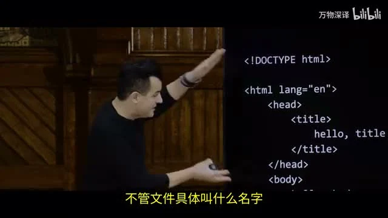

```html
<!DOCTYPE html>
<html lang="en">
  <head><title>hello, title</title></head>
  <body>hello, body</body>
</html>
```

`<head>` 中的 `<title>` 是页面元信息，通常显示在浏览器标签页；`<body>` 是页面正文。**元素（element）**通常由开始标签、内容、结束标签组成；**属性（attribute）**写在开始标签里，例如 `lang="en"`。这些元素嵌套起来形成树，后面 JavaScript 正是沿这棵树查找和修改页面。

列表和表格也有明确结构。例如无序列表用 `<ul>` 包住若干 `<li>`；浏览器会按结构给列表项加项目符号。图片用 ``，链接用 `<a href="...">...</a>`；光把网址写成普通文字，不会自动变成可点击链接。[【视频 60:00】](https://www.bilibili.com/video/BV1Lt6qBcExg/?p=10&t=3600)

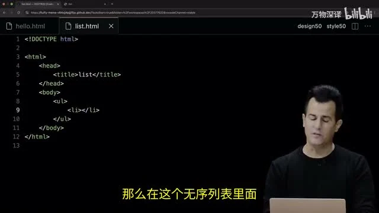

## 四、表单把用户输入变成请求，`name` 决定参数名

课堂用一个很短的表单做出“搜索 Google”的前端。核心并不是自己实现搜索算法，而是把用户输入提交给现成服务：[【视频 81:00】](https://www.bilibili.com/video/BV1Lt6qBcExg/?p=10&t=4860)

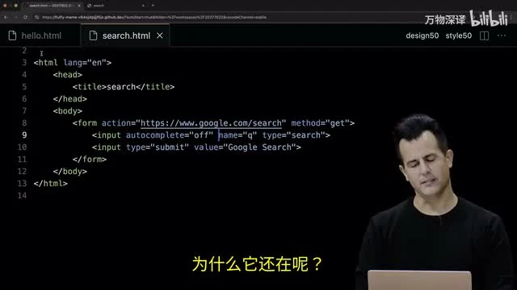

```html
<form action="https://www.google.com/search" method="get">
  <input name="q" type="search">
  <button>Google Search</button>
</form>
```

假设输入 `cats`，浏览器会请求类似 `https://www.google.com/search?q=cats` 的地址。`action` 决定提交到哪里，`method="get"` 决定用 GET，`name="q"` 决定查询参数的键；`cats` 才是用户填入的值。网页可以给输入框加 `placeholder`、`autofocus` 等属性，但这些只改善使用体验，不替代服务器处理输入。

**正则表达式（regular expression）**描述文本模式。课堂的注册示例用 `pattern="\d{3}-\d{3}-\d{4}"` 要求形如 `123-456-7890` 的号码：`\d` 表示数字，`{3}` 表示重复三次。浏览器的表单校验能及时提醒用户，但真实应用仍需在服务端验证数据。[【视频 84:00】](https://www.bilibili.com/video/BV1Lt6qBcExg/?p=10&t=5040)

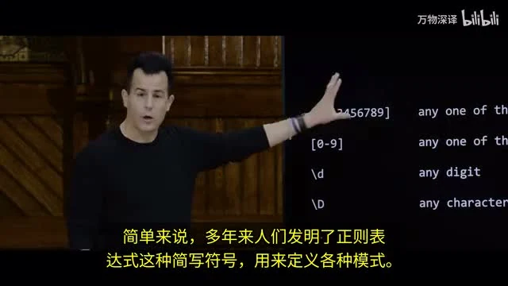

## 五、CSS 管外观，选择器决定规则应用到哪些元素

HTML 负责“这是什么”，**CSS（Cascading Style Sheets）**负责“它怎样显示”：字体、颜色、对齐、间距等。CSS 规则的骨架是 `选择器 { 属性: 值; }`。[【视频 91:30】](https://www.bilibili.com/video/BV1Lt6qBcExg/?p=10&t=5490)

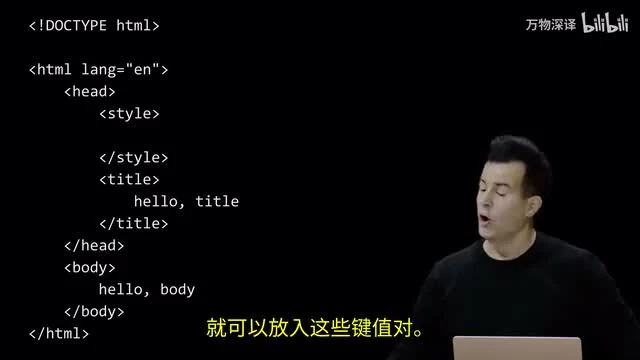

```css
body { text-align: center; }
.large { font-size: large; }
#notice { color: red; }
```

`body` 选择所有 `body` 元素；`.large` 选择 `class="large"` 的元素；`#notice` 选择 `id="notice"` 的元素。课堂先把样式写在 HTML 中，随后移到独立的 `home7.css`，用 `<link rel="stylesheet" href="home7.css">` 引入，这样多个页面可以共用一份样式。[【视频 103:30】](https://www.bilibili.com/video/BV1Lt6qBcExg/?p=10&t=6210)

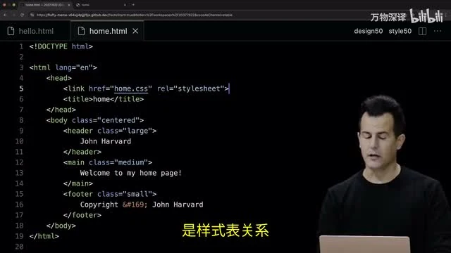

**Bootstrap** 是现成的 CSS 框架。它给开发者准备了常用布局和组件样式，能较快做出整齐的界面；理解原生 CSS 的选择器与属性后，才知道框架的类名究竟在帮你做什么。课堂示例见 [`bootstrap.html`](../source/src8/bootstrap.html)。

## 六、JavaScript 在浏览器中响应事件、修改页面

静态 HTML 加 CSS 已能显示页面，但用户点击按钮或输入文字后，页面若要立即变化，就需要客户端逻辑。课堂先用 `let counter = 0;`、条件和循环展示 JavaScript 的基本语法，再把它用于网页：JavaScript 可以读写 DOM（Document Object Model，文档对象模型），也就是浏览器从 HTML 建立的元素树。[【视频 114:00】](https://www.bilibili.com/video/BV1Lt6qBcExg/?p=10&t=6840)

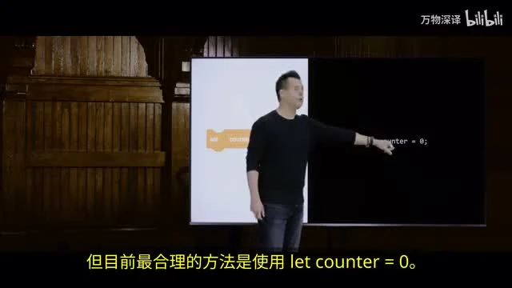

课堂的 `hello4.js` 把三件事连起来：等页面准备好、找到表单、在提交时运行函数。[【视频 123:00】](https://www.bilibili.com/video/BV1Lt6qBcExg/?p=10&t=7380)

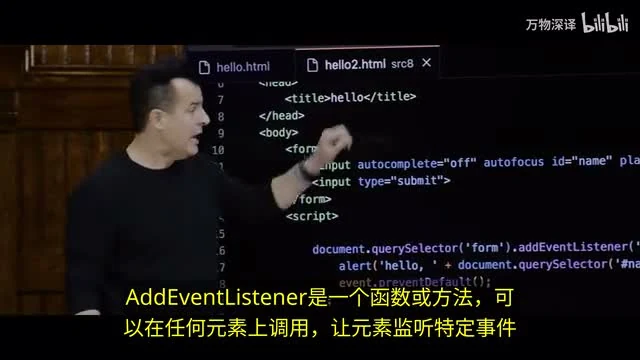

```javascript
document.addEventListener('DOMContentLoaded', function() {
    document.querySelector('form').addEventListener('submit', function(e) {
        alert('hello, ' + document.querySelector('#name').value);
        e.preventDefault();
    });
});
```

`querySelector('form')` 找表单，`querySelector('#name')` 找对应 ID 的输入框；`.value` 读取用户输入；`addEventListener` 规定发生 `submit` 时执行什么；`preventDefault()` 阻止浏览器按默认方式提交、跳转。它改变的是**当前浏览器页面的行为**，并没有自动把数据保存到服务器。[课堂源码：`hello4.js`](../source/src8/hello4.js)

JavaScript 也能直接改元素样式。课堂的红、绿、蓝按钮分别监听 `click`，再设置 `document.body.style.backgroundColor`；这说明 DOM 是一个可以在页面加载后继续修改的对象树。[【视频 129:00】](https://www.bilibili.com/video/BV1Lt6qBcExg/?p=10&t=7740)

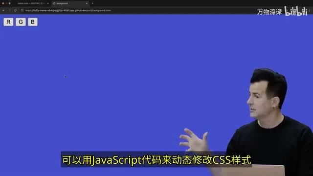

## 七、自动补全和定位把前面的方法组合起来

**自动补全**示例监听输入框的 `keyup`：每输入一个字符，就用循环筛选预先加载的单词，把匹配项写进 `<ul>`。它把变量、循环、条件、事件与 DOM 更新串成一个小应用。课堂版本从本地的 `WORDS` 列表筛选，因此不需要每敲一个字就向服务器请求；更大的真实数据集则可能改用接口。[【视频 135:00】](https://www.bilibili.com/video/BV1Lt6qBcExg/?p=10&t=8100)

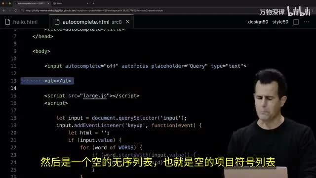

**定位**示例调用 `navigator.geolocation.getCurrentPosition(...)`，浏览器取得位置后才执行回调函数并读取经纬度。用户是否授权、浏览器能否得到位置，都会影响结果；不能把位置当成页面一打开就必然已有的变量。[【视频 139:30】](https://www.bilibili.com/video/BV1Lt6qBcExg/?p=10&t=8370)

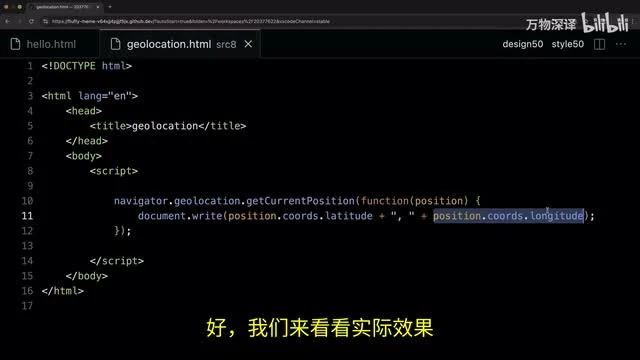

## 把整讲串起来

1. **网络层面**：DNS、IP、TCP 和端口让浏览器找到服务器并交换数据。
2. **请求层面**：HTTP 用方法、路径、状态码和正文组织一次问答。
3. **页面层面**：HTML 定结构，CSS 定外观，JavaScript 监听事件并修改 DOM。
4. **应用层面**：表单把输入发往服务，自动补全与定位展示浏览器可以在页面内运行更丰富的逻辑。下一讲 Flask 会把服务器端的 Python 带回这条链路。

**自测**：如果把 `search.html` 的 `name="q"` 删除，会少掉什么？如果只改 CSS，页面是否能自动记住用户提交的数据？如果点击按钮后背景色变了，哪一步是在服务器上完成的？能用“谁运行、读什么、改什么”回答这些问题，就抓住了本讲的核心。

## 术语速查

| 术语 | 在本讲里的作用 |
|---|---|
| IP / TCP | 分别处理网络寻址，以及连接、端口、顺序和可靠传输。 |
| DNS / DHCP | 分别查询域名地址，以及为设备自动配置接入网络所需参数。 |
| HTTP | 浏览器与服务器交换请求和响应的规则。 |
| HTML / CSS / JavaScript | 分别定义网页结构、样式和交互行为。 |
| DOM | 浏览器把 HTML 解析成的、可供 JavaScript 查找与修改的元素树。 |
| 事件监听器 | 指定点击、输入、提交等事件发生时运行的函数。 |

> 视频截图来自上述 B 站分集，课程术语与示例以 CS50 官方字幕、幻灯片和源码核对。笔记为学习整理，不代替课程原材料。
