# 尚硅谷 Git 第 09–15 集：从建立仓库到理解分支

> 来源：[尚硅谷《Git 全套教程》BV1vy4y1s7k6](https://www.bilibili.com/video/BV1vy4y1s7k6/?p=9)，第 09–15 集，共约 39 分 19 秒。整理日期：2026-10-11。截图为课堂原画面，保留讲师标注和水印。
> 本笔记根据视频关键画面、终端结果和讲义画面整理。平台与字幕服务未提供可用字幕，因此不称为逐字稿；另附[画面讲解记录](transcripts/Git-09-15-画面记录.md)。补充解释与练习明确标注。

**这七集建立的是一条完整的本地版本管理流程：创建仓库 → 编辑文件 → 查看状态 → 暂存 → 提交 → 修改并再次提交 → 切换版本。分支则让多条开发路线可以同时存在。**

先分清三个地方，再学命令会更容易：工作区是正在编辑的文件，暂存区保存下一次准备提交的内容，本地库保存已提交的版本。视频这几集讲本地操作，`commit` 不会将文件上传 GitHub。

```text
工作区                  暂存区                    本地提交历史
编辑 hello.txt ── add ──→ 准备提交的快照 ── commit ──→ first / second / third
```

## 阅读顺序与视频入口

| 集数 | 主题 | 看完应能回答 |
|---|---|---|
| [09](https://www.bilibili.com/video/BV1vy4y1s7k6/?p=9) | 初始化本地库 | 普通文件夹怎样变成 Git 仓库？ |
| [10](https://www.bilibili.com/video/BV1vy4y1s7k6/?p=10) | 查看本地库状态 | 新文件为什么还不属于提交历史？ |
| [11](https://www.bilibili.com/video/BV1vy4y1s7k6/?p=11) | 添加暂存区 | add 后文件在哪个状态？ |
| [12](https://www.bilibili.com/video/BV1vy4y1s7k6/?p=12) | 提交本地库 | commit 记录了什么，log 怎么看？ |
| [13](https://www.bilibili.com/video/BV1vy4y1s7k6/?p=13) | 修改文件 | 已跟踪文件修改后为什么还需 add？ |
| [14](https://www.bilibili.com/video/BV1vy4y1s7k6/?p=14) | 版本穿梭 | reset 改了哪些位置，如何找到旧提交？ |
| [15](https://www.bilibili.com/video/BV1vy4y1s7k6/?p=15) | 分支概述与优点 | 新功能和紧急修复为何适合分开？ |

## 09：在项目目录执行 init，才是为这个项目建立仓库

### 课堂例子：在 git-demo 目录创建本地库

讲师在 Windows 的 `D:/Git-Space/git-demo` 文件夹打开 Git Bash，再执行：

```bash
git init
```

终端返回 `Initialized empty Git repository in .../git-demo/.git/`，说明初始化成功，Git 管理数据放在 `.git` 中。此时没有提交；提示符里的 `(master)` 是分支名，不代表已经上传或产生版本。

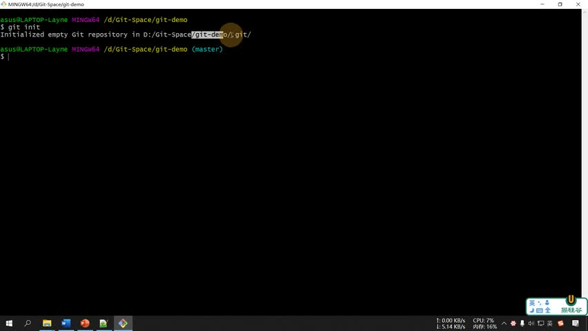

[回看 P09 02:30](https://www.bilibili.com/video/BV1vy4y1s7k6/?p=9&t=150)

### 指令与文件夹含义

| 指令/名称 | 含义 | 课堂中的作用 |
|---|---|---|
| `git init` | 在当前目录初始化 Git 仓库 | 创建 `.git` 管理数据 |
| `ll` | 常见的 shell 别名，通常对应详细列出目录 | 观察文件列表；它不是 Git 命令 |
| `ll -a` | 还列出隐藏条目；具体取决于 ll 别名定义 | 查看 `.git` |
| `cd .git` | 切换到 `.git` 目录 | 演示内部文件 |
| `cd ..` | 返回上一级目录 | 回到项目根目录 |

**可移植补充：** 你的终端未必定义 `ll`，可以使用 `ls -la`。macOS 的目录路径也不同，不能原样复制课堂的 Windows 盘符。

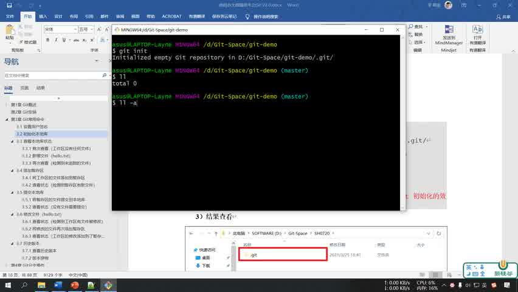

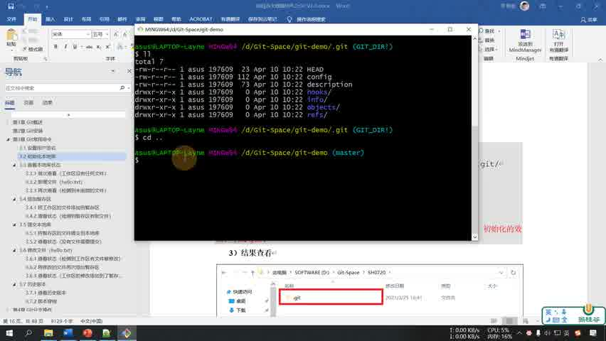

`.git` 保存对象、引用和配置，工作区文件通常在它外面。日常在项目根目录操作即可，不需要进入 `.git`；不要手动修改内部文件。**补充：** Git 一般向上查找仓库，所以误在上层目录建库可能使多个本不相关的项目被同一个仓库覆盖。可用 `git rev-parse --show-toplevel` 确认当前仓库根目录。

## 10：status 显示的是文件与 Git 当前记录之间的关系

### 空仓库：没有版本，也没有待提交文件

```bash
git status
```

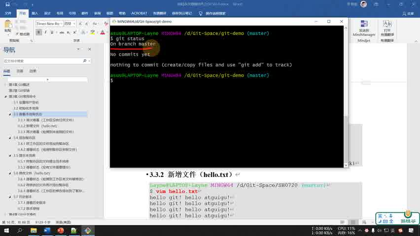

[回看 P10 00:40](https://www.bilibili.com/video/BV1vy4y1s7k6/?p=10&t=40)

| 输出 | 中文解释 |
|---|---|
| `On branch master` | 当前在 master 分支 |
| `No commits yet` | 还没有建立第一条提交 |
| `nothing to commit` | 当前没有准备提交的内容；不意味着已经提交过 |

### 创建 hello.txt 后，它先是未跟踪文件

课堂使用 `vim hello.txt` 创建文件，内容是多行 `hello atguigu! hello git!`，之后用 `ll`、`cat` 查看。对于初学者，重点在创建文件后查看 Git 状态，而不是必须学会 Vim。

```bash
vim hello.txt
cat hello.txt
git status
```

| 指令 | 含义 |
|---|---|
| `vim hello.txt` | 用 Vim 打开或创建 hello.txt；属于编辑器命令 |
| `cat hello.txt` | 将文件全文显示在终端；属于 shell 工具 |
| `cat -n hello.txt` | 显示内容并带行号 |
| `tail -n 1 hello.txt` | 只显示最后一行 |

**Vim 补充操作：** 按 `i` 进入输入模式，输入后按 `Esc`，输入 `:wq` 并回车保存退出。也可以直接使用你熟悉的图形编辑器，Git 不要求用 Vim。

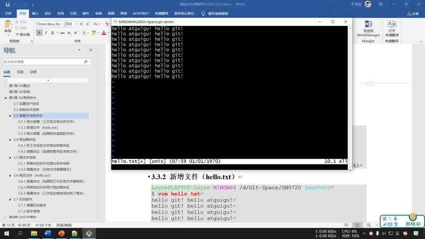

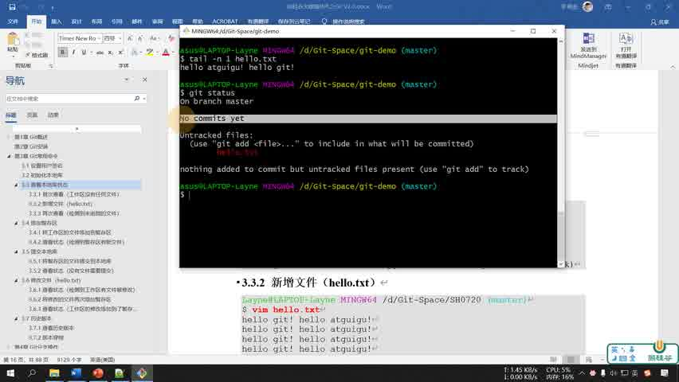

[回看 P10 04:10](https://www.bilibili.com/video/BV1vy4y1s7k6/?p=10&t=250)

`Untracked files` 是“Git 尚未跟踪的文件”。磁盘上存在 `hello.txt`，不代表 Git 已保存它的版本。颜色只是提示方式，判断时应阅读标题和文字。

## 11：add 暂存当时的内容，取消暂存不会删除工作区文件

### 将 hello.txt 放入下一次提交

```bash
git add hello.txt
git status
```

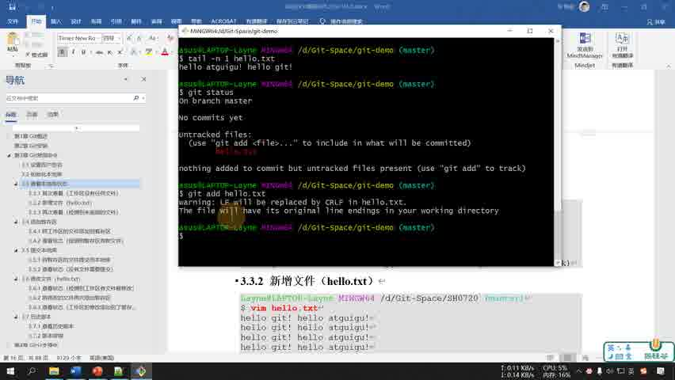

[回看 P11 00:40](https://www.bilibili.com/video/BV1vy4y1s7k6/?p=11&t=40)

课堂出现 `LF will be replaced by CRLF` 提示。LF 和 CRLF 是不同的换行表示，Git 的换行配置可能引起转换。它是警告，不表示 add 失败；接着看状态确认结果。**补充：** 不应为了消除提示随意改变全局配置，跨平台项目可以通过 `.gitattributes` 明确文本文件的换行规则。

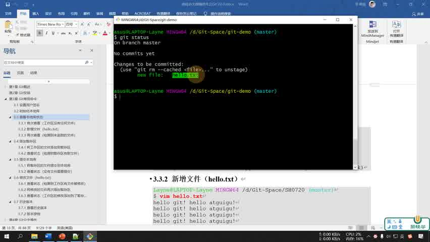

`Changes to be committed` 表示已经暂存；`new file: hello.txt` 表示下一次提交将纳入这个新文件。此时仍然 `No commits yet`，因为 add 和 commit 是两件事。

**关键补充：** add 暂存的是执行那一刻的内容。之后再编辑文件，新增修改不会自动进入暂存区，要再次 add。一个文件可以同时存在已暂存和未暂存修改。

### 课堂取消暂存示例：只退出暂存区，不删除文件

第一次提交之前，课堂的状态提示使用：

```bash
git rm --cached hello.txt
```

随后 `ll` 仍能看到 `hello.txt`，`git status` 再次把它列为未跟踪文件。截图记录的是取消暂存之后的状态：

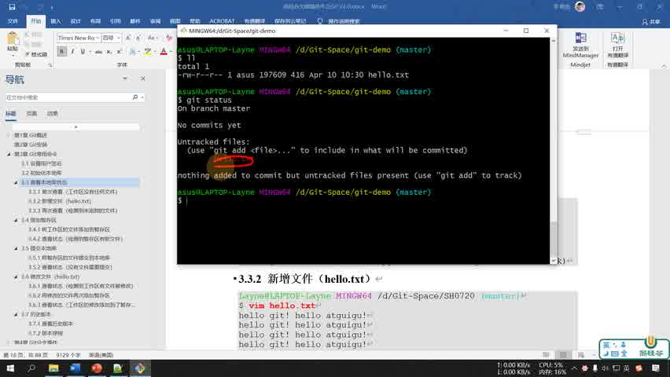

[回看 P11 03:30](https://www.bilibili.com/video/BV1vy4y1s7k6/?p=11&t=210)

- `rm` 是 Git 的移除操作，`--cached` 指只操作索引（暂存区），保留工作区文件。
- **这个例子尚无首次提交**，所以移出暂存区后文件回到未跟踪状态。
- **补充区别：** 已经提交过的文件执行 `git rm --cached`，会暂存“从版本管理中移除这个路径”，不是通常意义的撤销暂存。
- **现代补充：** 已有 HEAD 提交时，取消一次普通暂存通常用 `git restore --staged hello.txt`，保留工作区修改；首次提交前没有 HEAD 时，不能机械照用。

## 12：commit 将暂存快照保存到本地，log 和 reflog 各看不同的历史

### 建立 first commit

取消暂存练习之后，需要重新 add，然后提交：

```bash
git add hello.txt
git commit -m "first commit" hello.txt
git status
```

这是课堂写法。`-m` 指定提交说明，`"first commit"` 是字符串；尾部 `hello.txt` 是指定路径。


[回看 P12 01:45](https://www.bilibili.com/video/BV1vy4y1s7k6/?p=12&t=105)

| 输出 | 意思 |
|---|---|
| `[master (root-commit) 965c6a1] first commit` | 在 master 创建首个提交，短 ID 为 965c6a1，说明为 first commit |
| `1 file changed, 16 insertions(+)` | 这个提交记录一个文件的变化，新增 16 行 |
| `create mode 100644 hello.txt` | 建立普通非可执行文件条目；100644 是 Git 文件模式 |

**重要补充：** `git commit -m "说明" 文件名` 在已有跟踪文件上可以提交该路径的当前工作区内容，不一定是先前 add 的内容；它也不会顺便提交所有其他已暂存路径。初学者若要严格遵循“检查暂存区再提交”，推荐去掉末尾文件名：

```bash
git add hello.txt
git diff --staged
git commit -m "first commit"
```

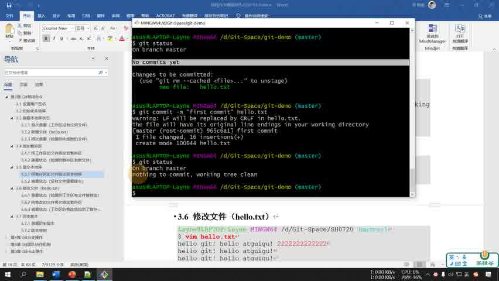

`working tree clean` 表示没有 Git 需要报告的待处理变化，不是文件夹为空。**补充：** 被忽略且未跟踪的文件可能仍存在；clean 也不说明远程是否已经同步。

### log 看提交，reflog 看引用移动记录

```bash
git reflog
git log
```

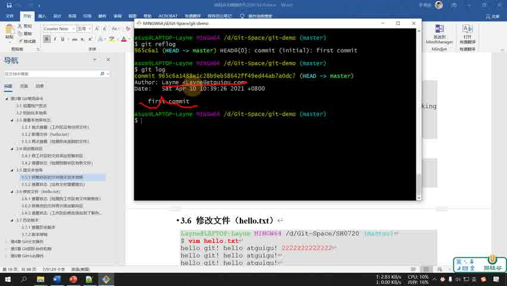

| 指令 | 看什么 | 用途 |
|---|---|---|
| `git log` | 从当前起点可达的提交及元数据 | 看谁在什么时候提交了什么 |
| `git reflog` | 本地 HEAD 等引用的移动记录 | 看提交、切换和 reset 后曾指向哪里 |
| `git log --oneline` | 每条提交压缩为一行，补充命令 | 快速查看提交列表 |

长日志如果进入分页器，按 `q` 退出。作者信息是提交配置里的身份，不自动等同于 GitHub 登录账号。提交 ID 由对象内容和元数据计算，不是“第几个版本”的连续编号，也不是文件修改时间。

## 13：已跟踪文件改动后，仍要选择暂存并建立新提交

### 从 first 到 second，再到 third

课堂修改 `hello.txt`，在第一行附加一串 `2`，然后提交说明为 `second commit`；再次编辑，产生 `third commit`。版本不是靠复制多个 `hello-最终版.txt` 保存，而是通过提交历史记录。

```bash
vim hello.txt
git status
git add hello.txt
git commit -m "second commit" hello.txt
git status
git reflog
```

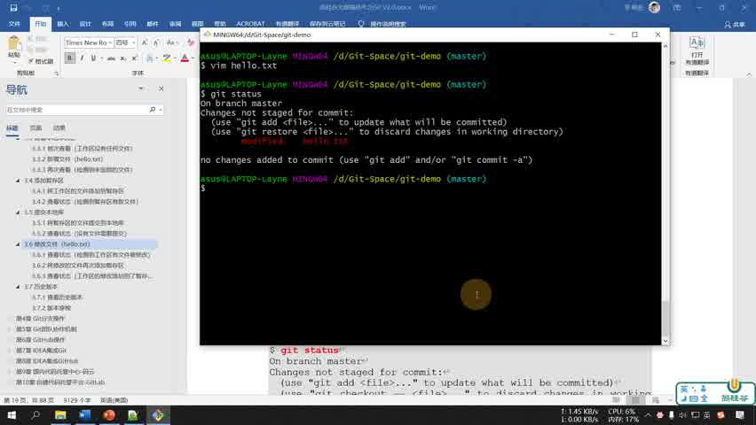

[回看 P13 01:10](https://www.bilibili.com/video/BV1vy4y1s7k6/?p=13&t=70)

此时 `modified: hello.txt` 表示 Git 已跟踪它，但工作区内容与当前暂存内容不同。它和新文件的 `Untracked files` 不同。

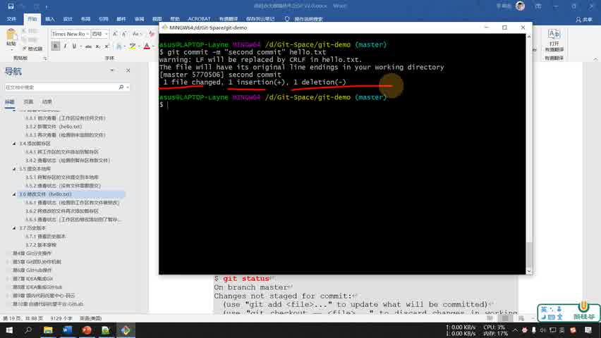

**为什么改一行却显示 `1 insertion(+), 1 deletion(-)`？** 文本差异把旧行移除、再加入新行表示为一行删除和一行插入，不意味着你手动删了一个文件。

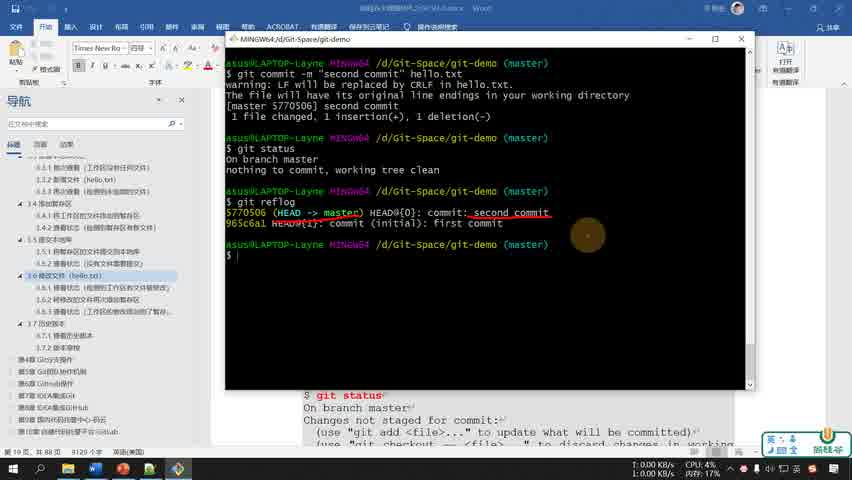

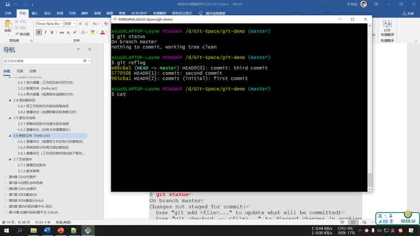

### diff 就是比较两份内容，显示哪里变了（补充）

**diff 是 difference（差异）的缩写。** 它不是保存版本的命令，而是查看命令：比较两份内容，把增加、删除和修改显示出来。先看一个只有一行的例子。

#### 1. 改一行，为什么会显示一行删除和一行插入？

假设 `hello.txt` 已提交，内容原来是：

```text
hello git
```

你用编辑器把它改为下面的内容，保存，但先不要 add：

```text
hello git 222
```

执行 `git diff`，会看到类似输出，哈希等细节因仓库而异：

```diff
diff --git a/hello.txt b/hello.txt
index ... 100644
--- a/hello.txt
+++ b/hello.txt
@@ -1 +1 @@
-hello git
+hello git 222
```

先读最后两行就能理解变化：

| 标记 | 含义 | 这个例子 |
|---|---|---|
| `-` | 被比较的旧内容里移除的行 | `hello git` |
| `+` | 被比较的新内容里加入的行 | `hello git 222` |
| 空格 | 附近没有变化的行，用于定位上下文 | 本例只有一行，没有上下文行 |

行首 `+`、`-` 是 diff 的标记，不属于文件正文。Git 把“改一行”表达成“去掉旧行，再加入新行”，因此提交统计可能是 **`1 insertion(+), 1 deletion(-)`**；不是删除了一个文件。

上面其余部分可以这样读：

- `a/hello.txt` 和 `b/hello.txt` 表示比较的旧侧与新侧，不是磁盘上真的新增了 a、b 两个目录。
- `---` 与 `+++` 是两侧文件名的标题；不要把它们当成三行删除、三行插入。
- `@@ -1 +1 @@` 表示这个差异片段位于旧侧第 1 行和新侧第 1 行。更一般的 `@@ -3,2 +3,3 @@` 表示旧侧从第 3 行取 2 行，新侧从第 3 行取 3 行。
- `index ... 100644` 是对象标识与文件模式等信息，理解普通文本修改时可以先略过。

#### 2. git diff 和 git diff --staged，到底在比较哪两份？

同一个文件可以同时有三个版本：你正在编辑的工作区版本、已经 add 的暂存区版本，以及最近提交 HEAD 中的版本。

```text
最近提交 HEAD          暂存区               工作区
hello git              hello git            hello git 222
       ← --staged 比较 →        ← git diff 比较 →
```

| 命令 | 比较对象 | 用普通话说 |
|---|---|---|
| `git diff` | 暂存区 → 工作区 | 我改了什么，还没 add？ |
| `git diff --staged` | HEAD → 暂存区 | 下一次 commit 准备记录什么？ |
| `git diff HEAD` | HEAD → 工作区 | 已跟踪文件相比上次提交，总共改了什么？ |

这里的箭头表示“旧侧到新侧的比较”，不是执行 add 或 commit。`--staged` 指查看已暂存内容；`git diff --cached` 是它的同义写法。

#### 3. 按顺序操作，看看输出为什么改变

下面是一段独立示意，假设文件最初已提交为 `hello git`。每次编辑后都保存文件：

| 时刻 | 工作区 | 暂存区 | HEAD | `git diff` | `git diff --staged` |
|---|---|---|---|---|---|
| 刚提交完成 | `hello git` | `hello git` | `hello git` | 无差异 | 无差异 |
| 编辑成 222，尚未 add | `hello git 222` | `hello git` | `hello git` | 显示原文 → 222 | 无差异 |
| 执行 add 后 | `hello git 222` | `hello git 222` | `hello git` | 无差异 | 显示原文 → 222 |
| 执行 commit 后 | `hello git 222` | `hello git 222` | `hello git 222` | 无差异 | 无差异 |

对应命令顺序是：

```bash
# 先用编辑器把 hello git 改成 hello git 222，并保存
git diff -- hello.txt

# 选择这个文件的当前内容进入暂存区
git add hello.txt

# 此时工作区与暂存区相同，所以这条通常没有输出
git diff -- hello.txt

# 修改已经进入暂存区，这条仍能看到原文到 222 的变化
git diff --staged -- hello.txt

# 检查无误后保存暂存快照到本地历史
git commit -m "update greeting"
```

命令里的 `--` 用来分隔命令选项与文件路径，`hello.txt` 限定只看这个文件。不写路径时，会比较相应范围内的所有文件。

**add 后 git diff 没输出，不是改动消失了。** 它只是说明工作区和暂存区相同；准备提交的改动转到 `git diff --staged` 中查看。

#### 4. add 后继续编辑，为什么同一个文件有两份差异？

假设你已 add `hello git 222`，之后又把工作区改成 `hello git 333`，但没有再次 add：

```text
HEAD：hello git
暂存区：hello git 222
工作区：hello git 333
```

- `git diff` 显示 **222 → 333**：这一段还未暂存。
- `git diff --staged` 显示 **原文 → 222**：这是准备提交的内容。
- 直接执行不带文件名的 `git commit -m "说明"`，保存的是 **222**。
- 要提交 **333**，先再次 `git add hello.txt`，再检查 staged diff。

这也是“add 保存执行当时的内容，而不是自动追踪之后的编辑”的具体含义。课堂的 `commit ... hello.txt` 属于指定路径提交，行为见前面第 12 集说明；上面的例子采用不带路径的普通 commit，以便明确保存暂存快照。

#### 5. 没输出时，还应注意什么？

新建的未跟踪文件尚未进入索引，普通 `git diff` 不会展示它的正文。先用 `git status` 确认，再 add 并用 `git diff --staged` 检查。文件未保存时，Git 也只能读到磁盘上已保存的内容。

**日常记忆：编辑后用 diff 看修改；add 后用 diff --staged 检查提交内容；确认后再 commit。**

## 14：reset --hard 是移动当前分支并重置文件，不只是查看旧版

### 课堂已有三个提交

画面中的短 ID 是：

```text
965c6a1  first commit
5770506  second commit
e88c8a5  third commit
```

**这些 ID 只对应讲师的仓库。** 自己做相同练习，ID 通常也不同，必须从自己的 log/reflog 复制。

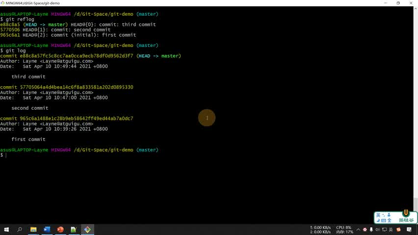

[回看 P14 01:40](https://www.bilibili.com/video/BV1vy4y1s7k6/?p=14&t=100)

### 回到 second：分支、暂存区与工作区一起变化

课堂运行：

```bash
git reset --hard 5770506
git reflog
cat hello.txt
```

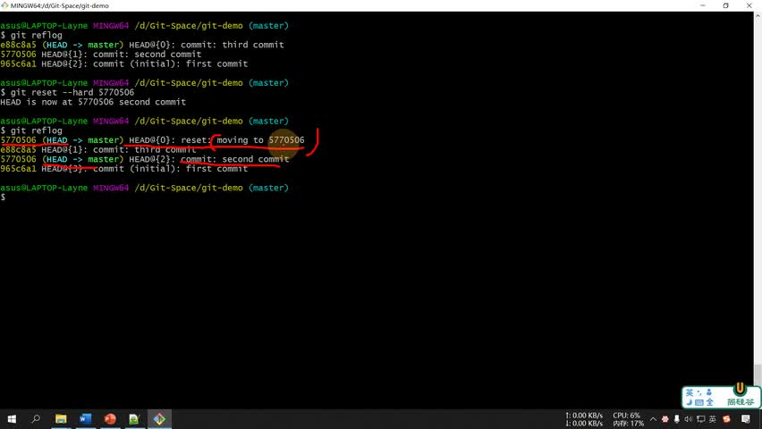

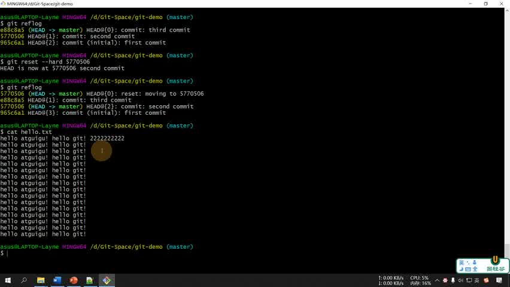

[回看 P14 03:40](https://www.bilibili.com/video/BV1vy4y1s7k6/?p=14&t=220)

`reset` 调整当前位置；`--hard` 还将暂存区和工作区的已跟踪文件恢复到目标状态。运行前的未提交修改会被丢弃；若未跟踪文件阻碍目标路径恢复，也可能被删除。它不是“只取消暂存”，不要在自己的正式项目里随意照做。

**课堂之后继续回到 first、再向 third 前进。** 通过 `reflog` 仍能找到旧位置，再对第三条提交 ID 执行 reset；旧提交并非 reset 后立即从存储中消失。但是 reflog 是本地记录，有保留期限，不能把它当永久备份。

### 逐行理解这三条命令：先恢复，再查记录，最后看文件（补充）

**它们是三个独立步骤，分别执行。只有第一条会改变当前版本和文件，后两条只是查看。**

先用简化的一行文件说明。提交 ID 沿用课堂，文件正文为解释用示意，不是课堂多行正文的逐字复制：

| 提交 ID | 提交说明 | hello.txt 内容（示意） |
|---|---|---|
| `965c6a1` | first commit | `hello git` |
| `5770506` | second commit | `hello git 222` |
| `e88c8a5` | third commit | `hello git 333` |

假设你在 master，刚完成 third，当前文件就是 `hello git 333`。

#### 第一步：git reset --hard 5770506，真正恢复到 second

```bash
git reset --hard 5770506
```

| 部分 | 意思 |
|---|---|
| `git reset` | 把当前位置重设到指定提交；在此普通分支状态下会移动 master |
| `--hard` | 暂存区和工作区的已跟踪文件也恢复成目标提交的状态 |
| `5770506` | 要恢复的提交 ID，这里是 second；不是行号，也不是文件名 |

执行前后可以这样比较：

| 位置 | 执行前 | 执行后 |
|---|---|---|
| HEAD | 指向 master | 仍指向 master |
| master | 指向 third | 改为指向 second |
| 暂存区中的 hello.txt | `hello git 333` | `hello git 222` |
| 工作区中的 hello.txt | `hello git 333` | `hello git 222` |

终端通常输出类似 `HEAD is now at 5770506 second commit`，表示已经恢复。**不是只把终端显示切到旧版，而是磁盘上的文件内容也会改变。** 未提交的修改可能因此丢失；第三次提交本身则不会因为这次 reset 立即从对象存储中消失。

#### 第二步：git reflog，查看本地“最近去过哪些位置”

```bash
git reflog
```

它不执行恢复，而是展示本地 HEAD 的移动记录。刚才 reset 后，可能显示如下；这里为了教学省略颜色与分支装饰：

```text
5770506 HEAD@{0}: reset: moving to 5770506
e88c8a5 HEAD@{1}: commit: third commit
5770506 HEAD@{2}: commit: second commit
965c6a1 HEAD@{3}: commit (initial): first commit
```

从上往下，由新到旧阅读：

- 第 1 行：最近一次操作是 reset，操作后处在 `5770506`，也就是 second。
- 第 2 行：之前提交了 third，当时处在 `e88c8a5`。这行帮助你找到恢复前的位置。
- 第 3 行：更早提交了 second。
- 第 4 行：最早建立了 first。

`HEAD@{0}` 表示 HEAD 的最新一条记录，`HEAD@{1}` 表示前一条记录，依此类推。花括号里的数字是记录位置，**不是提交的版本编号**；新操作会使这些序号变化，所以需要看当前输出。

reflog 像本地的“位置足迹”，不只记提交，还记 reset、切换等操作。相比之下，`git log` 默认沿当前提交的父链看历史：回到 second 后，普通 log 通常只看到 second 和 first，third 不在这条父链上；reflog 仍能提供 third 的线索。

#### 第三步：cat hello.txt，直接查看磁盘上的文件内容

```bash
cat hello.txt
```

`cat` 是显示文件内容的工具，不是 Git 命令。`hello.txt` 是要读取的文件路径。因为第一步已经恢复了工作区，这里输出：

```text
hello git 222
```

它的作用是确认“文件确实变回了 second”，不负责切换版本，也不会创建提交。

把整段连起来读就是：

```bash
git reset --hard 5770506  # 把 master、暂存区和工作区恢复到 second
git reflog               # 查看刚才的恢复操作，以及此前 third 等位置
cat hello.txt            # 读出恢复后的文件，确认当前内容
```

如果后来想恢复到 third，可以从当前 reflog 找到它的 ID，再执行 `git reset --hard <third的ID>`；这会再次重置文件，仍要先保存未提交工作。**只想看看 second 的内容，则用 `git show <second的ID>:hello.txt`，无需 reset。** 实际练习必须使用自己仓库的 ID，不能直接复制课堂编号。

### HEAD、分支与提交：两级指针帮助理解版本变化

在普通分支状态下可以理解为：

```text
HEAD → master → third
                 ↓ 父提交
               second
                 ↓ 父提交
                first
```

reset 到 second 后，`HEAD` 仍指向 master，而 master 改为指向 second。

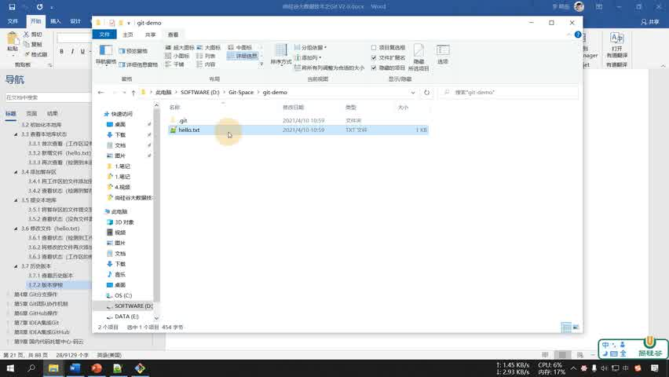

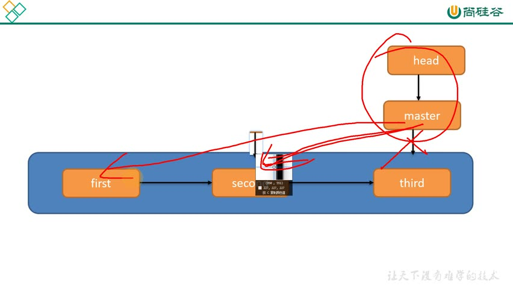

**补充：** 课堂用松散引用文件说明机制，实际 Git 也可能将引用打包；不要依靠手工编辑 `.git` 改版本。图中若使用从 first 向 third 的演进箭头，它表示开发顺序；提交对象实际记录指向父提交的引用，箭头语义要区分。

### HEAD、master/main、分支和提交：分别指什么？（补充）

**HEAD 标记当前检出位置；master 或 main 是分支名字；分支指向提交；提交保存某个版本的快照和历史关系。** 它们不是四个不同的文件夹。

| 名称 | 是什么 | 例子 |
|---|---|---|
| 提交（commit） | 一个不可变的版本记录，包含快照、父提交与元数据 | second commit，ID 为 `5770506` |
| 分支（branch） | 一条命名的开发路线，在实现上主要是可移动的提交引用 | master、main、feature |
| master / main | 两个常见分支名，本身没有特殊权限或不同功能 | 课堂用 master，AI-wiki 用 main |
| HEAD | 标记当前检出位置，通常通过当前分支指向提交 | `HEAD → master → third` |

#### master 不是“总仓库”，也不是固定的某个版本

master 是旧版 Git 常用的初始分支名；现在许多项目采用 main。仓库可以配置其他初始分支名，所以不能仅凭系统或 Git 版本推断名字。

在 master 上产生第四次提交后，master 会移动：

```text
提交前：HEAD → master → third
提交后：HEAD → master → fourth
```

third 仍作为历史提交存在。master 也不代表 GitHub：本地可以有 master，远程服务器也可以有同名分支，它们需要通过 fetch、整合与 push 同步。

#### HEAD 不是“永远最新的提交”

通常，HEAD 指向你当前所在的分支：

```text
HEAD → master → third
```

这里“最新”只能理解为当前分支的末端，不是整个仓库所有分支里时间最新的提交。切换到 feature 后，HEAD 指向 feature；master 保持自己的位置：

```text
HEAD → feature → feature 的末端提交
       master  → master 的末端提交
```

在普通分支状态下执行 `git reset --hard 5770506`，HEAD 仍指向当前分支，当前分支移到 second，同时重置文件。如果直接执行 `git switch --detach <提交ID>`，HEAD 就直接指向提交，不再通过分支，这叫 detached HEAD（分离头指针）。在这种状态查看旧版可以；若创建了想保留的新提交，应建立分支，例如 `git switch -c saved-work`。

#### 用三条只读命令确认当前位置

```bash
git branch --show-current
git rev-parse --short HEAD
git log -1 --oneline
```

第一条显示当前分支名，第二条显示 HEAD 对应的短提交 ID，第三条显示当前位置这条提交的简要信息。detached HEAD 状态下，第一条通常没有输出，而后两条仍能显示提交。`git branch -v` 也能看到本地分支列表，当前分支通常有 `*`。

**记忆例子：HEAD 表示“我现在站在哪”；分支是这条路线的名字；提交是路线上的一个具体版本。**

### 只想读旧版时，用影响更小的方法（补充）

```bash
# 只显示某次提交的文件，不切换分支，也不修改磁盘文件
git show <提交ID>:hello.txt

# 查看那个版本的整个项目；应先妥善保存未提交工作
git switch --detach <提交ID>

# 结束查看，回到原分支；分支名以实际为准
git switch master
```

`--detach` 直接让 HEAD 指向提交，不移动 master。若在 detached 状态产生了要保留的新提交，可以新建分支保存它。视频使用 master，你的仓库可能叫 main。`git show <提交ID>:hello.txt` 的路径相对于仓库根目录。

## 15：分支让新功能和紧急修复沿不同路线发展

### 课堂示意：功能开发期间仍可处理线上问题

讲义展示 master、feature-blue、feature-game 与 hot-fix。可以这样理解：稳定版本继续在 master；蓝色功能和游戏功能各在自己的分支开发；发现线上 bug 后，从稳定版本分出 hot-fix 修复，再把修复整合回需要它的路线。

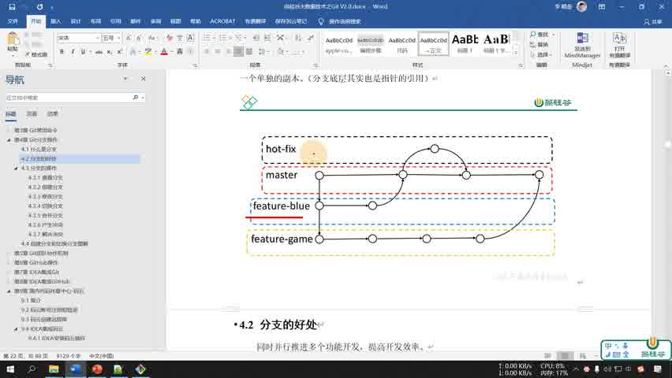

[回看 P15 02:40](https://www.bilibili.com/video/BV1vy4y1s7k6/?p=15&t=160)

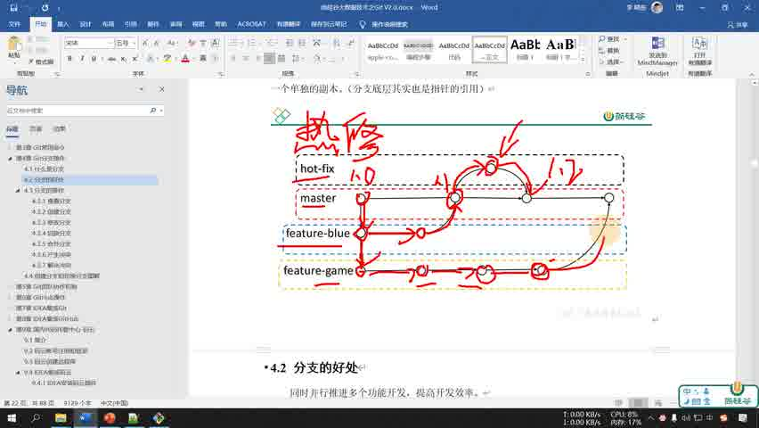

分支的价值是隔离开发路线：未完成的功能不会直接成为稳定分支的新提交，功能失败也可以停止沿该路线开发；多个开发者可以并行推进，再合并成果。

**准确补充：** 分支主要是指向提交的可移动引用，不是复制完整项目文件夹。切换分支时，工作区会随之变化；普通分支不提供两个同时存在的文件夹，若要同时打开两套工作区，另有 `git worktree`。并行开发仍可能产生合并冲突，“互不影响”应理解为历史路线隔离，而不是自动消除文件修改冲突。

### P15 末尾的分支指令表是后续实操入口

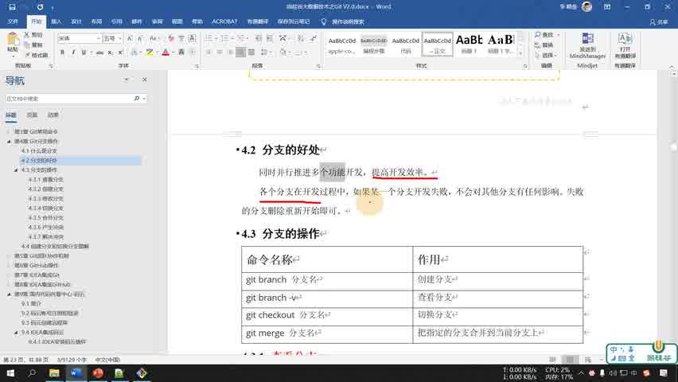

| 课堂指令 | 含义 | 补充提醒 |
|---|---|---|
| `git branch 分支名` | 创建分支 | 不自动切换 |
| `git branch -v` | 查看本地分支及末端提交摘要 | 当前分支通常有 `*` |
| `git checkout 分支名` | 切换分支 | 现代可用 `git switch 分支名` |
| `git merge 分支名` | 把指定分支整合进当前分支 | 先确认当前分支；可能冲突 |

P15 主要介绍概念与优点，不能把上表写成已经在这集完整演示的分支实操。下一节给的是补充练习。

## 一个可重做的最小练习：用三次提交看懂状态和分支

**以下是本笔记整理的独立练习，非课堂逐字操作。** 在新的练习目录执行，不要在 AI-wiki 内练习 hard reset。提交身份只写到这个练习仓库，不修改用户全局配置。

```bash
mkdir git-demo-practice
cd git-demo-practice
git init -b main
git config user.name "Git Learner"
git config user.email "learner@example.com"
git status

printf 'hello git\n' > hello.txt
git status
git add hello.txt
git diff --staged
git commit -m "first commit"

printf 'hello git 222\n' > hello.txt
git diff
git add hello.txt
git commit -m "second commit"

printf 'hello git 333\n' > hello.txt
git add hello.txt
git commit -m "third commit"
git log --oneline
```

`printf` 输出文本，`\n` 是换行，`>` 把输出写入并覆盖文件，因此只在这个练习里使用。这里是一行的精简示例，课堂文件有多行。`git init -b main` 在支持该选项的 Git 中明确设定初始分支名；旧版 Git 可以使用 `git init` 并查看实际分支。

查看 second 的内容，不需要 reset：

```bash
git show HEAD~1:hello.txt
```

`HEAD~1` 指 HEAD 的第一父提交，此例为 second。继续试分支：

```bash
git switch -c feature-note
printf 'feature work\n' >> hello.txt
git add hello.txt
git commit -m "add feature note"
git switch main
cat hello.txt
git merge feature-note
cat hello.txt
```

`switch -c` 创建并切换，`>>` 追加而不覆盖。回 main 后还看不到 feature 新增那行；合并后才看到。本练习中 main 没产生分叉新提交，合并通常是快进（fast-forward），并不一定创建新的合并提交。

## 在 Mac 上学习：Git 概念相同，主要替换目录与终端用法

**HEAD、分支、master/main、提交、工作区与暂存区，在 macOS、Windows 和 Linux 上含义相同。** 课堂使用 Windows Git Bash，并不影响在 Mac 上理解这些概念。

| 课堂环境 | Mac 上怎么理解或操作 |
|---|---|
| `D:/Git-Space/git-demo` | 替换为自己的目录，例如 `/Users/gemini/AI-wiki` |
| 在文件夹右键打开 Git Bash | 打开“终端”，使用 `cd` 进入项目目录 |
| `ll`、`ll -a` | 未定义这个别名时，使用 `ls -l`、`ls -la` |
| 当前分支叫 master | 用 `git branch --show-current` 查询实际名字，可能是 main |
| `vim hello.txt` | Mac 也可用 Vim，或使用熟悉的编辑器并保存 |
| `cat hello.txt` | Mac 终端同样支持，作用是显示文件内容 |
| LF/CRLF 转换警告 | 是否出现取决于文件和 Git 配置，不是所有 Mac 都会出现 |

例如在 Mac 上确认 AI-wiki 所属仓库与当前位置：

```bash
cd /Users/gemini/AI-wiki
pwd                           # 查看终端当前目录
git rev-parse --show-toplevel  # 确认当前所属仓库根目录
git branch --show-current     # 查询当前分支名
git status                    # 查看暂存、未暂存与未跟踪状态
```

`cd` 是进入文件夹，不是打开笔记文件；`pwd`、`ls`、`cat` 属于终端工具，不是 Git 命令。Git 通常能从仓库子目录向上找到仓库，因此不必进入 `.git`。

`git add`、`git commit`、`git diff`、`git reflog` 和 `git reset --hard` 的主要含义在 Mac 上相同。操作后果也相同：**换成 Mac 不会让 hard reset 变成只读命令，它仍可能丢弃未提交修改。** 练习时用独立目录；命令里的分支名与提交 ID 都以自己的仓库输出为准。

## 命令速查：先判断目的，再决定操作

| 想做什么 | 命令 | 会改变什么 |
|---|---|---|
| 建仓库 | `git init` | 创建 Git 管理数据 |
| 看状态 | `git status` | 不修改文件 |
| 选择下次提交内容 | `git add hello.txt` | 暂存区 |
| 保存暂存快照 | `git commit -m "说明"` | 新提交及当前分支位置 |
| 看提交 | `git log` | 只读 |
| 看本地引用移动 | `git reflog` | 只读 |
| 只读某版本的文件 | `git show ID:hello.txt` | 只读 |
| 取消普通暂存，有 HEAD 时 | `git restore --staged hello.txt` | 暂存区；保留工作区 |
| 按课堂回退分支并恢复文件 | `git reset --hard ID` | 当前分支、暂存区、工作区；可能丢失修改 |
| 新建分支 | `git branch name` | 新分支引用 |
| 新建并切换 | `git switch -c name` | 新分支、HEAD 和工作区 |
| 合并目标路线 | `git merge name` | 当前分支及可能的文件内容 |

## 学完后检查是否理解

- 文件出现在文件夹里，只说明它存在；`Untracked files` 表示它还未被跟踪。
- add 不等于 commit；commit 不等于 push。这七集的版本都保存到本地。
- clean 不表示目录为空，也不表示已同步 GitHub。
- 重新编辑已有文件仍要检查状态，并选择新的提交内容。
- reset 的目标 ID 必须来自自己的仓库，不能复制截图中的 ID。
- 普通分支状态下，HEAD 指向当前分支，分支指向提交；版本切换和分支切换要看它们分别怎么移动。

## 来源与核对说明

课堂画面来自尚硅谷原视频，截图时间与分 P 在图旁标注；终端可见命令和结果按画面核对。没有可用字幕，本笔记不覆盖无法从画面确认的全部口头解释；补充部分为理解与练习所需的独立说明。原视频署名和水印保留，截图仅用于对应课程内容的学习讲解。

命令细节参考官方文档：[git init](https://git-scm.com/docs/git-init)、[git status](https://git-scm.com/docs/git-status)、[git add](https://git-scm.com/docs/git-add)、[git commit](https://git-scm.com/docs/git-commit)、[git rm](https://git-scm.com/docs/git-rm)、[git reset](https://git-scm.com/docs/git-reset)、[git reflog](https://git-scm.com/docs/git-reflog)、[git switch](https://git-scm.com/docs/git-switch)。

[返回 Git 目录](README.md)
